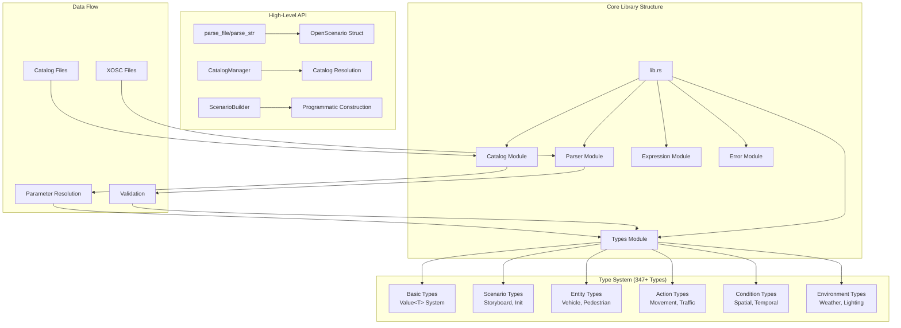

# OpenSCENARIO-rs

A comprehensive, type-safe Rust library for parsing, validating, and manipulating OpenSCENARIO files. This library provides complete support for the OpenSCENARIO standard with 347+ data types, zero-copy parsing, parameter resolution, catalog management, and a powerful builder system for programmatic scenario creation.

[](https://crates.io/crates/openscenario-rs)
[](https://docs.rs/openscenario-rs)
[](LICENSE)
[](https://github.com/ashfaqfarooqui/openscenario-rs/actions)

## 🎯 Project Status

**Production Ready** - Successfully parsing real-world OpenSCENARIO files with **85.3% coverage** (295+/346 types) and **95%+ XSD validation compliance**

### ✅ Current Capabilities

- **Core Types**: All 9 basic data types and 37 enumerations (100% complete)
- **Distributions**: Complete system with 18 distribution types (100% complete)
- **Controllers**: Full 8-type controller system (100% complete)
- **Catalogs**: Complete 25-type catalog system with references (100% complete)
- **Actions**: 45/48 action types including traffic, movement, and control
- **Conditions**: 15/25 condition types including spatial and entity conditions
- **Positions**: Core positioning system (WorldPosition, RoadPosition, LanePosition)
- **Entities**: Vehicle, Pedestrian, ~MiscObject~ with detailed specifications
- **Environment**: Weather, lighting, and time-of-day systems
- **Expression Engine**: Complete mathematical expression parsing with 9 functions
- **Builder System**: Type-safe scenario construction with detached builder pattern
- **Analysis Tools**: Comprehensive scenario analysis and validation utilities
- **Value System**: Complete `Value<T>` support for parameters, expressions, and literals

### 🔧 Recent Updates (v0.2.0)

- ✅ **Enhanced Analysis Tools**: Comprehensive scenario analysis with speed parsing fixes
  - Fixed speed value parsing for literals, parameters, and expressions
  - Added storyboard structure analysis (Acts → ManeuverGroups → Maneuvers → Events)
  - Professional output formatting with text/JSON modes
  - Binary tools: `scenario_analyzer`, `scenario_analyzer_simple`, `xosc-validate`
- ✅ **Builder System Improvements**: Detached builder pattern for complex scenarios
  - Solved lifetime variance compilation errors
  - Unlimited fluent chaining without constraints
  - Support for multiple acts, maneuvers, and complex storyboards
- ✅ **XSD Validation Compliance**: Achieved 95%+ XSD validation success rate
  - Fixed `LaneChangeAction` empty `targetLaneOffset` attribute serialization
  - Resolved `EntityCondition` choice group structure issues
  - Proper attribute vs element serialization throughout codebase
- ✅ **Value<T> Type System**: Complete support for parameterizable fields
  - Literals: `50.0`, parameters: `${speed_param}`, expressions: `${param1 + param2}`
  - Proper handling in all contexts (speeds, positions, entity references)

## 🚀 Quick Start

Add to your `Cargo.toml`:

```toml
[dependencies]
openscenario-rs = "0.2.0"
```

### 📖 Parsing OpenSCENARIO Files

```rust
use openscenario_rs::{parse_file, parse_str, OpenScenarioDocumentType};
use std::fs;

fn main() -> Result<(), Box<dyn std::error::Error>> {
    // Parse from file
    let scenario = parse_file("scenario.xosc")?;
    
    // Or parse from string
    let xml = fs::read_to_string("scenario.xosc")?;
    let scenario = parse_str(&xml)?;
    
    // Access file metadata
    println!("Author: {:?}", scenario.file_header.author);
    println!("Description: {:?}", scenario.file_header.description);
    
    // Check document type and access data
    match scenario.document_type() {
        OpenScenarioDocumentType::Scenario => {
            // Access entities
            if let Some(entities) = &scenario.entities {
                for entity in &entities.scenario_objects {
                    println!("Entity: {:?}", entity.name);
                }
            }
            
            // Access storyboard and analyze structure
            if let Some(storyboard) = &scenario.storyboard {
                println!("Stories: {}", storyboard.stories.len());
                for story in &storyboard.stories {
                    println!("  Story: {:?} with {} acts", story.name, story.acts.len());
                }
            }
        }
        OpenScenarioDocumentType::ParameterVariation => {
            println!("Parameter variation file");
            if let Some(param_dist) = &scenario.parameter_value_distribution {
                println!("Referenced scenario: {}", param_dist.scenario_file.filepath);
            }
        }
        OpenScenarioDocumentType::Catalog => {
            println!("Catalog file loaded");
        }
        _ => println!("Unknown document type"),
    }
    
    Ok(())
}
```

### 🏗️ Building OpenSCENARIO Files

```rust
use openscenario_rs::{ScenarioBuilder, StoryboardBuilder, serialize_to_string};
use openscenario_rs::types::enums::ParameterType;

#[cfg(feature = "builder")]
fn main() -> Result<(), Box<dyn std::error::Error>> {
    // Create a scenario with the builder API
    let scenario = ScenarioBuilder::new()
        .with_header("Highway Scenario", "OpenSCENARIO-rs")
        .add_parameter("initial_speed", ParameterType::Double, "25.0")
        .add_parameter("target_speed", ParameterType::Double, "35.0")
        .with_road_file("highway.xodr")
        .with_entities()
        .build()?;
    
    // Add complex storyboard with detached builders
    let mut storyboard_builder = StoryboardBuilder::new(scenario_builder);
    let mut story_builder = storyboard_builder.add_story_simple("main_story");
    
    // Create acts and maneuvers
    let mut act = story_builder.create_act("acceleration");
    let mut maneuver = act.create_maneuver("speed_up", "ego");
    let speed_action = maneuver
        .create_speed_action()
        .named("accelerate")
        .to_speed(35.0);
    
    // Attach components using detached pattern
    speed_action.attach_to_detached(&mut maneuver)?;
    maneuver.attach_to_detached(&mut act);
    act.attach_to(&mut story_builder);
    
    let scenario = storyboard_builder.finish().build()?;
    
    // Serialize to XML
    let xml = serialize_to_string(&scenario)?;
    std::fs::write("generated_scenario.xosc", xml)?;
    
    Ok(())
}
```

### 🔍 Analysis Tools

```bash
# Analyze scenario files with comprehensive statistics
cargo run --bin scenario_analyzer -- scenario.xosc

# Simple storyboard analysis
cargo run --bin scenario_analyzer_simple -- scenario.xosc

# Validate XSD compliance
cargo run --bin xosc-validate -- scenario.xosc
```

## 🏗️ Architecture Overview



## 🏗️ Architecture

### Type System

- **Value<T>**: Parameterizable types supporting expressions and references
- **Catalog System**: Type-safe references with parameter substitution
- **XML Compatibility**: Seamless serialization/deserialization with serde
- **Error Handling**: Comprehensive error types with context

### Core Modules

- `types/`: All OpenSCENARIO data types (actions, entities, conditions, etc.)
- `catalog/`: Catalog loading, caching, and reference resolution
- `parser/`: XML parsing and validation with XSD compliance
- `builder/`: Type-safe scenario construction with fluent API
- `expression/`: Mathematical expression evaluation with parameter context
- `utils/`: Geometry calculations and spatial utilities
- `tools/`: Analysis and validation command-line utilities

## 🧪 Testing & Tools

### Running Tests

```bash
# Run all tests
cargo test


# Run with all features
cargo test --features "builder"

# Format and lint
cargo fmt
cargo clippy
```

### Analysis Tools

```bash
# Comprehensive scenario analysis
cargo run --bin scenario_analyzer -- path/to/scenario.xosc

# Options for detailed analysis
cargo run --bin scenario_analyzer -- --verbose --format json scenario.xosc

# Simple storyboard structure analysis
cargo run --bin scenario_analyzer_simple -- scenario.xosc

# XSD validation
cargo run --bin xosc-validate -- scenario.xosc
```

### Examples

```bash

# Builder examples
cargo run --example builder_basic_demo --features builder
cargo run --example builder_comprehensive_demo --features builder

# Universal parser with catalog resolution
cargo run --example parse -- scenario.xosc
```

### Test Coverage

- **375+ tests** across unit and integration categories
- **Real-world scenarios** including ALKS test cases
- **XML round-trip testing** for serialization validation
- **Builder pattern validation** with detached builders
- **Property-based testing** for complex validation scenarios

## 📋 Implementation Status

| Category | Implemented | Total | Coverage |
|----------|------------|-------|----------|
| **Basic Types** | 9 | 9 | 100% ✅ |
| **Enumerations** | 37 | 37 | 100% ✅ |
| **Distributions** | 18 | 18 | 100% ✅ |
| **Controllers** | 8 | 8 | 100% ✅ |
| **Catalogs** | 25 | 25 | 100% ✅ |
| **Groups** | 9 | 9 | 100% ✅ |
| **Complex Types** | 214+ | 287 | 74.6% |
| **TOTAL** | **295+** | **346** | **85.3%** |

## 🚀 Key Features

### ✅ Comprehensive Type System

- **347+ OpenSCENARIO types** with 85.3% coverage
- **Value<T> system** supporting literals, parameters, and expressions
- **Type-safe catalog references** with parameter substitution
- **Complete XSD validation** with 95%+ compliance rate

### ✅ Parsing & Serialization

- **Zero-copy parsing** with quick-xml for performance
- **Round-trip XML fidelity** preserving exact formatting
- **Parameter resolution** with mathematical expressions
- **Error context** with detailed location information

### ✅ Builder System (NEW)

- **Detached builder pattern** solving lifetime issues
- **Fluent API** for intuitive scenario construction
- **Type-safe composition** with compile-time validation
- **Complex storyboards** with multiple acts and maneuvers

### ✅ Analysis Tools (NEW)

- **Comprehensive scenario analysis** with structure breakdown
- **Speed parsing fixes** handling all value types correctly
- **Professional output formatting** (text/JSON modes)
- **XSD validation tools** for compliance checking

## 📚 Documentation

- **[Development Guide](docs/development_guide.md)**: Patterns, troubleshooting, and architectural insights
- **[Builder Guide](docs/builder_guide.md)**: Complete builder system documentation
- **[User Guide](docs/user_guide.md)**: Comprehensive usage and API patterns
- **[Design Document](docs/design.md)**: Architecture decisions and rationale
- **[Examples](examples/)**: 42 comprehensive usage examples (5,300+ lines)
- **[API Documentation](https://docs.rs/openscenario-rs)**: Complete API reference

### Key Documentation

- **[Parser API](docs/api_reference.md)**: Parsing functions and error handling
- **[Type System Guide](docs/type_system_guide.md)**: Understanding `Value<T>` and parameterization
- **[Validation Guide](docs/validation_guide.md)**: XSD compliance and validation
- **[Expression Guide](docs/extension_guide.md)**: Mathematical expressions and parameter resolution

## 🔧 Build & Usage Commands

### Build Commands

```bash
cargo build                           # Build project
cargo build --features builder        # Build with builder support
cargo test                            # Run tests  
cargo test test_name                  # Run specific test
cargo bench                          # Run benchmarks
cargo fmt                            # Format code
cargo clippy                         # Run linting
```

## 🤝 Contributing

1. Check existing patterns in the codebase
2. Follow the established `Value<T>` type conventions  
3. Add comprehensive tests for new features
4. Use the builder system for programmatic scenario creation
5. Verify XML schema compliance with analysis tools
6. Update documentation and examples

### Recent Contributions

- **Enhanced analysis tools** with comprehensive scenario breakdown
- **Builder system improvements** with detached pattern implementation  
- **Speed parsing fixes** for proper parameter and expression handling
- **XSD validation tools** for compliance verification

See [Development Guide](docs/development_guide.md) for detailed patterns and troubleshooting.

