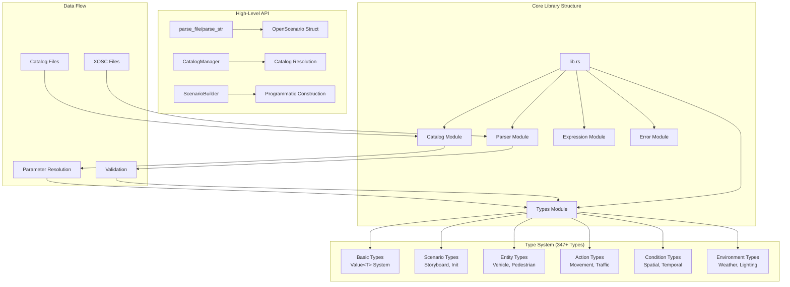

# OpenSCENARIO-rs

A comprehensive, type-safe Rust library for parsing, validating, and manipulating OpenSCENARIO files. This library provides complete support for the OpenSCENARIO standard with 347+ data types, zero-copy parsing, parameter resolution, and catalog management.

[](https://crates.io/crates/openscenario-rs)
[](https://docs.rs/openscenario-rs)
[](LICENSE)
[](https://github.com/ashfaqfarooqui/openscenario-rs/actions)

## 🎯 Project Status

**Production Ready** - Successfully parsing real-world OpenSCENARIO files with **85.3% coverage** (295+/346 types)

### ✅ Current Capabilities

- **Core Types**: All 9 basic data types and 37 enumerations (100% complete)
- **Distributions**: Complete system with 18 distribution types (100% complete)
- **Controllers**: Full 8-type controller system (100% complete)
- **Catalogs**: Complete 25-type catalog system with references (100% complete)
- **Actions**: 45/48 action types including traffic, movement, and control
- **Conditions**: 15/25 condition types including spatial and entity conditions
- **Positions**: Core positioning system (WorldPosition, RoadPosition, LanePosition)
- **Entities**: Vehicle, Pedestrian, MiscObject with detailed specifications
- **Environment**: Weather, lighting, and time-of-day systems
- **Expression Engine**: Complete mathematical expression parsing with 9 functions

### 🔧 Recent Fixes (Latest)

- ✅ **XML Serialization Issues Resolved**: Fixed `TrafficSwarmAction` test failures
- ✅ **Value<T> Type System**: Proper handling of parameterizable fields
- ✅ **Compilation Errors**: All test compilation issues resolved
- ✅ **Schema Compliance**: Verified against OpenSCENARIO XSD standards

## 🚀 Quick Start

Add to your `Cargo.toml`:
```toml
[dependencies]
openscenario-rs = "0.1.0"
```

Parse and explore OpenSCENARIO files:
```rust
use openscenario_rs::{parse_file, Result, OpenScenarioDocumentType};

fn main() -> Result<()> {
    // Parse an OpenSCENARIO file
    let scenario = parse_file("scenario.xosc")?;
    
    // Access file metadata
    println!("Author: {}", scenario.file_header.author.as_literal().unwrap());
    println!("Description: {}", scenario.file_header.description.as_literal().unwrap());
    
    // Check document type
    match scenario.document_type() {
        OpenScenarioDocumentType::Scenario => {
            // Access entities
            if let Some(entities) = &scenario.entities {
                for entity in &entities.scenario_objects {
                    println!("Entity: {}", entity.name.as_literal().unwrap());
                }
            }
        }
        OpenScenarioDocumentType::Catalog => {
            println!("Catalog file loaded");
        }
        _ => println!("Other document type"),
    }
    
    Ok(())
}
```

## 🏗️ Architecture Overview



## 🏗️ Architecture

### Type System
- **Value<T>**: Parameterizable types supporting expressions and references
- **Catalog System**: Type-safe references with parameter substitution
- **XML Compatibility**: Seamless serialization/deserialization with serde
- **Error Handling**: Comprehensive error types with context

### Core Modules
- `types/`: All OpenSCENARIO data types (actions, entities, conditions, etc.)
- `catalog/`: Catalog loading, caching, and reference resolution
- `parser/`: XML parsing and validation
- `expression/`: Mathematical expression evaluation
- `utils/`: Geometry calculations and utilities

## 🧪 Testing

```bash
# Run all tests
cargo test

# Run specific test categories
cargo test integration_tests
cargo test catalog_tests
cargo test expression_tests

# Run with full features
cargo test --features full

# Format and lint
cargo fmt
cargo clippy
```

### Test Coverage
- **375+ tests** across unit and integration categories
- **Real-world scenarios** including ALKS test cases
- **XML round-trip testing** for serialization validation
- **Property-based testing** for complex validation scenarios

## 📋 Implementation Status

| Category | Implemented | Total | Coverage |
|----------|------------|-------|----------|
| **Basic Types** | 9 | 9 | 100% ✅ |
| **Enumerations** | 37 | 37 | 100% ✅ |
| **Distributions** | 18 | 18 | 100% ✅ |
| **Controllers** | 8 | 8 | 100% ✅ |
| **Catalogs** | 25 | 25 | 100% ✅ |
| **Groups** | 9 | 9 | 100% ✅ |
| **Complex Types** | 214+ | 287 | 74.6% |
| **TOTAL** | **295+** | **346** | **85.3%** |

## 🎯 Development Phases

### ✅ Phase 1: Core Functionality (Complete)
Foundation types, entities, basic actions, and scenario structure

### ✅ Phase 2: Extended Actions (Complete)  
Movement, routing, and controller actions

### ✅ Phase 3: Advanced Features (Complete)
Distributions, controllers, and complete catalog system

### 📋 Phase 4: Specialized Features (Planned)
Animation, lighting, traffic signals, and advanced geometry

## 📚 Documentation

- **[Development Guide](docs/development_guide.md)**: Patterns, troubleshooting, and architectural insights
- **[Design Document](docs/design.md)**: Architecture decisions and rationale
- **[Examples](examples/)**: Comprehensive usage examples
- **[API Documentation](https://docs.rs/openscenario-rs)**: Complete API reference

## 🔧 Build Commands

```bash
cargo build              # Build project
cargo test               # Run tests  
cargo test test_name     # Run specific test
cargo bench             # Run benchmarks
cargo fmt               # Format code
cargo clippy            # Run linting
```

## 🤝 Contributing

1. Check existing patterns in the codebase
2. Follow the established `Value<T>` type conventions
3. Add comprehensive tests for new features
4. Verify XML schema compliance
5. Update documentation

See [Development Guide](docs/development_guide.md) for detailed patterns and troubleshooting.

## 📄 License

Licensed under either of:
- Apache License, Version 2.0 ([LICENSE-APACHE](LICENSE-APACHE))
- MIT License ([LICENSE-MIT](LICENSE-MIT))

at your option.

## 🙏 Acknowledgments

- OpenSCENARIO working group for the specification
- Rust community for excellent XML and parsing libraries
- Contributors and testers