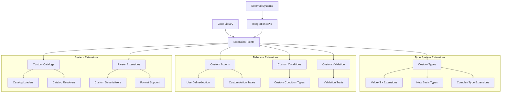

# OpenSCENARIO-rs Extension and Customization Guide

This guide covers how to extend the OpenSCENARIO-rs library with custom functionality, add new types, implement custom validation, and integrate with external systems.

## Table of Contents

1. [Extension Overview](#extension-overview)
2. [Custom Types](#custom-types)
3. [Custom Actions](#custom-actions)
4. [Custom Conditions](#custom-conditions)
5. [Custom Validation](#custom-validation)
6. [Catalog Extensions](#catalog-extensions)
7. [Parser Extensions](#parser-extensions)
8. [Expression Extensions](#expression-extensions)
9. [Integration Patterns](#integration-patterns)
10. [Publishing Extensions](#publishing-extensions)

## Extension Overview

OpenSCENARIO-rs is designed with extensibility in mind, providing multiple extension points for custom functionality while maintaining type safety and schema compliance.

### Extension Architecture



### Extension Principles

1. **Type Safety** - Extensions maintain Rust's type safety guarantees
2. **Schema Compliance** - Custom elements follow OpenSCENARIO patterns
3. **Backward Compatibility** - Extensions don't break existing functionality
4. **Testability** - All extensions include comprehensive tests
5. **Documentation** - Extensions are well-documented with examples

## Custom Types

### Creating Custom Value Types

Extend the `Value<T>` system with domain-specific types:

```rust
use openscenario_rs::types::{Value, ParameterContext, Resolve};
use serde::{Serialize, Deserialize};

/// Custom type for GPS coordinates with validation
#[derive(Debug, Clone, PartialEq, Serialize, Deserialize)]
pub struct GPSCoordinate {
    latitude: Value<f64>,
    longitude: Value<f64>,
    altitude: Option<Value<f64>>,
}

impl GPSCoordinate {
    pub fn new(lat: f64, lon: f64) -> Result<Self, openscenario_rs::Error> {
        if lat < -90.0 || lat > 90.0 {
            return Err(openscenario_rs::Error::validation_error(
                "latitude",
                "Latitude must be between -90 and 90 degrees"
            ));
        }
        if lon < -180.0 || lon > 180.0 {
            return Err(openscenario_rs::Error::validation_error(
                "longitude", 
                "Longitude must be between -180 and 180 degrees"
            ));
        }
        
        Ok(Self {
            latitude: Value::literal(lat),
            longitude: Value::literal(lon),
            altitude: None,
        })
    }
    
    pub fn with_altitude(mut self, alt: f64) -> Self {
        self.altitude = Some(Value::literal(alt));
        self
    }
    
    pub fn with_parameterized_lat(mut self, param: String) -> Self {
        self.latitude = Value::parameter(param);
        self
    }
}

impl Resolve<(f64, f64, Option<f64>)> for GPSCoordinate {
    fn resolve(&self, ctx: &ParameterContext) -> openscenario_rs::Result<(f64, f64, Option<f64>)> {
        let lat = self.latitude.resolve(ctx)?;
        let lon = self.longitude.resolve(ctx)?;
        let alt = if let Some(alt_val) = &self.altitude {
            Some(alt_val.resolve(ctx)?)
        } else {
            None
        };
        
        Ok((lat, lon, alt))
    }
}
```

### Custom Measurement Types

Create specialized measurement types with unit conversion:

```rust
use std::fmt;

/// Distance measurement with multiple unit support
#[derive(Debug, Clone, PartialEq, Serialize, Deserialize)]
pub struct Distance {
    value: Value<f64>,
    unit: DistanceUnit,
}

#[derive(Debug, Clone, Copy, PartialEq, Serialize, Deserialize)]
pub enum DistanceUnit {
    #[serde(rename = "m")]
    Meters,
    #[serde(rename = "km")]
    Kilometers,
    #[serde(rename = "ft")]
    Feet,
    #[serde(rename = "mi")]
    Miles,
}

impl Distance {
    pub fn meters(value: f64) -> Self {
        Self {
            value: Value::literal(value),
            unit: DistanceUnit::Meters,
        }
    }
    
    pub fn kilometers(value: f64) -> Self {
        Self {
            value: Value::literal(value),
            unit: DistanceUnit::Kilometers,
        }
    }
    
    /// Convert to meters for calculations
    pub fn to_meters(&self) -> Option<f64> {
        let value = self.value.as_literal()?;
        Some(match self.unit {
            DistanceUnit::Meters => *value,
            DistanceUnit::Kilometers => *value * 1000.0,
            DistanceUnit::Feet => *value * 0.3048,
            DistanceUnit::Miles => *value * 1609.34,
        })
    }
}

impl fmt::Display for Distance {
    fn fmt(&self, f: &mut fmt::Formatter<'_>) -> fmt::Result {
        if let Some(value) = self.value.as_literal() {
            write!(f, "{} {:?}", value, self.unit)
        } else {
            write!(f, "{:?} {:?}", self.value, self.unit)
        }
    }
}
```

## Custom Actions

### UserDefinedAction Extensions

Extend OpenSCENARIO with custom actions using the `UserDefinedAction` mechanism:

```rust
use openscenario_rs::types::{UserDefinedAction, OSString};

#[derive(Debug, Clone, PartialEq, Serialize, Deserialize)]
pub struct TrafficLightControlAction {
    pub traffic_light_id: OSString,
    pub state: TrafficLightState,
    pub duration: Option<Value<f64>>,
}

#[derive(Debug, Clone, Copy, PartialEq, Serialize, Deserialize)]
pub enum TrafficLightState {
    #[serde(rename = "red")]
    Red,
    #[serde(rename = "yellow")]
    Yellow,
    #[serde(rename = "green")]
    Green,
    #[serde(rename = "flashing")]
    Flashing,
}

impl TrafficLightControlAction {
    pub fn new(light_id: &str, state: TrafficLightState) -> Self {
        Self {
            traffic_light_id: OSString::literal(light_id.to_string()),
            state,
            duration: None,
        }
    }
    
    pub fn with_duration(mut self, duration: f64) -> Self {
        self.duration = Some(Value::literal(duration));
        self
    }
    
    /// Convert to UserDefinedAction for use in scenarios
    pub fn into_user_defined_action(self) -> UserDefinedAction {
        UserDefinedAction {
            type_name: OSString::literal("TrafficLightControl".to_string()),
            // Serialize custom action as XML content
            content: quick_xml::se::to_string(&self).unwrap(),
        }
    }
}

// Example usage
fn create_traffic_light_scenario() -> openscenario_rs::Result<()> {
    let traffic_action = TrafficLightControlAction::new("intersection_01", TrafficLightState::Red)
        .with_duration(30.0)
        .into_user_defined_action();
    
    // Use in scenario construction...
    Ok(())
}
```

### Domain-Specific Action Collections

Create action collections for specific domains:

```rust
/// Collection of autonomous vehicle specific actions
pub mod autonomous_vehicle_actions {
    use super::*;
    
    #[derive(Debug, Clone, PartialEq, Serialize, Deserialize)]
    pub struct AutonomousDrivingAction {
        pub mode: AutonomousMode,
        pub parameters: AutonomousParameters,
    }
    
    #[derive(Debug, Clone, Copy, PartialEq, Serialize, Deserialize)]
    pub enum AutonomousMode {
        #[serde(rename = "manual")]
        Manual,
        #[serde(rename = "assisted")]
        Assisted,
        #[serde(rename = "autonomous")]
        Autonomous,
        #[serde(rename = "emergency")]
        Emergency,
    }
    
    #[derive(Debug, Clone, PartialEq, Serialize, Deserialize)]
    pub struct AutonomousParameters {
        pub following_distance: Option<Distance>,
        pub max_speed: Option<Value<f64>>,
        pub lane_change_aggressiveness: Option<Value<f64>>,
    }
    
    impl AutonomousDrivingAction {
        pub fn engage_autonomous(following_distance: Distance) -> Self {
            Self {
                mode: AutonomousMode::Autonomous,
                parameters: AutonomousParameters {
                    following_distance: Some(following_distance),
                    max_speed: None,
                    lane_change_aggressiveness: None,
                },
            }
        }
    }
}
```

## Custom Conditions

### Custom Condition Types

Extend the condition system with domain-specific conditions:

```rust
use openscenario_rs::types::{Rule, Value, Boolean, Double};

#[derive(Debug, Clone, PartialEq, Serialize, Deserialize)]
pub struct WeatherCondition {
    pub precipitation_level: Double,
    pub rule: Rule,
    pub visibility_range: Option<Double>,
}

impl WeatherCondition {
    pub fn new(precipitation_mm_per_hour: f64, rule: Rule) -> Self {
        Self {
            precipitation_level: Double::literal(precipitation_mm_per_hour),
            rule,
            visibility_range: None,
        }
    }
    
    pub fn with_visibility(mut self, visibility_meters: f64) -> Self {
        self.visibility_range = Some(Double::literal(visibility_meters));
        self
    }
}

#[derive(Debug, Clone, PartialEq, Serialize, Deserialize)]
pub struct BatteryLevelCondition {
    pub vehicle_ref: OSString,
    pub battery_level_percent: Double,
    pub rule: Rule,
}

impl BatteryLevelCondition {
    pub fn new(vehicle: &str, level_percent: f64, rule: Rule) -> Self {
        Self {
            vehicle_ref: OSString::literal(vehicle.to_string()),
            battery_level_percent: Double::literal(level_percent),
            rule,
        }
    }
}

// Integration with existing condition system
#[derive(Debug, Clone, PartialEq, Serialize, Deserialize)]
pub enum CustomConditionType {
    #[serde(rename = "WeatherCondition")]
    Weather(WeatherCondition),
    
    #[serde(rename = "BatteryLevelCondition")]
    BatteryLevel(BatteryLevelCondition),
}
```

### Condition Evaluation Engine

Create a custom condition evaluation engine:

```rust
use std::collections::HashMap;

pub struct ConditionEvaluator {
    entity_states: HashMap<String, EntityState>,
    environment_state: EnvironmentState,
    custom_evaluators: HashMap<String, Box<dyn ConditionEvaluatorTrait>>,
}

pub trait ConditionEvaluatorTrait {
    fn evaluate(&self, condition: &CustomConditionType, context: &EvaluationContext) -> bool;
}

#[derive(Debug, Clone)]
pub struct EvaluationContext {
    pub current_time: f64,
    pub entities: HashMap<String, EntityState>,
    pub environment: EnvironmentState,
}

#[derive(Debug, Clone)]
pub struct EntityState {
    pub position: (f64, f64, f64),
    pub velocity: (f64, f64, f64),
    pub battery_level: Option<f64>,
    // ... other state
}

#[derive(Debug, Clone)]
pub struct EnvironmentState {
    pub precipitation: f64,
    pub visibility: f64,
    pub temperature: f64,
    // ... other environment data
}

impl ConditionEvaluator {
    pub fn new() -> Self {
        Self {
            entity_states: HashMap::new(),
            environment_state: EnvironmentState::default(),
            custom_evaluators: HashMap::new(),
        }
    }
    
    pub fn register_evaluator(&mut self, name: String, evaluator: Box<dyn ConditionEvaluatorTrait>) {
        self.custom_evaluators.insert(name, evaluator);
    }
    
    pub fn evaluate_condition(&self, condition: &CustomConditionType) -> bool {
        let context = EvaluationContext {
            current_time: 0.0, // Get from simulation
            entities: self.entity_states.clone(),
            environment: self.environment_state.clone(),
        };
        
        match condition {
            CustomConditionType::Weather(weather_condition) => {
                if let Some(precipitation) = weather_condition.precipitation_level.as_literal() {
                    self.evaluate_rule(*precipitation, context.environment.precipitation, &weather_condition.rule)
                } else {
                    false // Parameter resolution needed
                }
            }
            CustomConditionType::BatteryLevel(battery_condition) => {
                if let (Some(vehicle), Some(target_level)) = (
                    battery_condition.vehicle_ref.as_literal(),
                    battery_condition.battery_level_percent.as_literal()
                ) {
                    if let Some(entity_state) = context.entities.get(vehicle) {
                        if let Some(current_level) = entity_state.battery_level {
                            self.evaluate_rule(*target_level, current_level, &battery_condition.rule)
                        } else {
                            false
                        }
                    } else {
                        false
                    }
                } else {
                    false
                }
            }
        }
    }
    
    fn evaluate_rule(&self, target: f64, current: f64, rule: &Rule) -> bool {
        match rule {
            Rule::GreaterThan => current > target,
            Rule::LessThan => current < target,
            Rule::EqualTo => (current - target).abs() < f64::EPSILON,
            Rule::GreaterOrEqual => current >= target,
            Rule::LessOrEqual => current <= target,
            Rule::NotEqualTo => (current - target).abs() >= f64::EPSILON,
        }
    }
}
```

## Custom Validation

### Domain-Specific Validation Rules

Implement custom validation for domain-specific requirements:

```rust
use openscenario_rs::types::{Validate, ValidationContext, Error, Result};

pub struct AutomotiveValidationContext {
    base_context: ValidationContext,
    safety_standards: SafetyStandards,
    vehicle_specifications: HashMap<String, VehicleSpec>,
}

#[derive(Debug, Clone)]
pub struct SafetyStandards {
    pub max_acceleration: f64,
    pub max_deceleration: f64,
    pub min_following_distance: f64,
    pub max_speed_urban: f64,
    pub max_speed_highway: f64,
}

#[derive(Debug, Clone)]
pub struct VehicleSpec {
    pub max_speed: f64,
    pub max_acceleration: f64,
    pub max_deceleration: f64,
    pub length: f64,
    pub width: f64,
}

impl AutomotiveValidationContext {
    pub fn new() -> Self {
        Self {
            base_context: ValidationContext::new(),
            safety_standards: SafetyStandards::default(),
            vehicle_specifications: HashMap::new(),
        }
    }
    
    pub fn with_safety_standards(mut self, standards: SafetyStandards) -> Self {
        self.safety_standards = standards;
        self
    }
    
    pub fn add_vehicle_spec(&mut self, vehicle_name: String, spec: VehicleSpec) {
        self.vehicle_specifications.insert(vehicle_name, spec);
    }
}

// Custom validation for speed actions
impl Validate for openscenario_rs::types::SpeedAction {
    fn validate(&self, ctx: &ValidationContext) -> Result<()> {
        // Standard validation first
        if let Some(automotive_ctx) = ctx.downcast::<AutomotiveValidationContext>() {
            // Domain-specific validation
            if let Some(target_speed) = self.get_target_speed() {
                if target_speed > automotive_ctx.safety_standards.max_speed_urban {
                    return Err(Error::validation_error(
                        "speed_target",
                        "Speed exceeds urban safety limits"
                    ));
                }
            }
            
            // Validate acceleration limits
            if let Some(acceleration) = self.get_acceleration() {
                if acceleration > automotive_ctx.safety_standards.max_acceleration {
                    return Err(Error::validation_error(
                        "acceleration",
                        "Acceleration exceeds safety limits"
                    ));
                }
            }
        }
        
        Ok(())
    }
}

// Custom validation for distance conditions
pub struct DistanceValidationRule;

impl DistanceValidationRule {
    pub fn validate_following_distance(
        leading_vehicle: &str,
        following_vehicle: &str,
        distance: f64,
        ctx: &AutomotiveValidationContext,
    ) -> Result<()> {
        if distance < ctx.safety_standards.min_following_distance {
            return Err(Error::validation_error(
                "distance",
                &format!(
                    "Following distance {} is below minimum safe distance {}",
                    distance, ctx.safety_standards.min_following_distance
                )
            ));
        }
        
        // Validate based on vehicle specifications
        if let (Some(lead_spec), Some(follow_spec)) = (
            ctx.vehicle_specifications.get(leading_vehicle),
            ctx.vehicle_specifications.get(following_vehicle),
        ) {
            let min_distance = (lead_spec.length + follow_spec.length) / 2.0 + 2.0; // 2m buffer
            if distance < min_distance {
                return Err(Error::validation_error(
                    "distance",
                    &format!(
                        "Distance {} is less than minimum physical clearance {}",
                        distance, min_distance
                    )
                ));
            }
        }
        
        Ok(())
    }
}
```

### Validation Plugin System

Create a plugin system for validation rules:

```rust
pub trait ValidationPlugin: Send + Sync {
    fn name(&self) -> &str;
    fn validate_scenario(&self, scenario: &OpenScenario) -> Vec<ValidationError>;
    fn validate_action(&self, action: &Action) -> Vec<ValidationError>;
    fn validate_condition(&self, condition: &Condition) -> Vec<ValidationError>;
}

#[derive(Debug, Clone)]
pub struct ValidationError {
    pub severity: ValidationSeverity,
    pub field_path: String,
    pub message: String,
    pub suggestion: Option<String>,
}

#[derive(Debug, Clone, Copy, PartialEq)]
pub enum ValidationSeverity {
    Error,
    Warning,
    Info,
}

pub struct ValidationEngine {
    plugins: Vec<Box<dyn ValidationPlugin>>,
}

impl ValidationEngine {
    pub fn new() -> Self {
        Self {
            plugins: Vec::new(),
        }
    }
    
    pub fn register_plugin(&mut self, plugin: Box<dyn ValidationPlugin>) {
        self.plugins.push(plugin);
    }
    
    pub fn validate_scenario(&self, scenario: &OpenScenario) -> ValidationReport {
        let mut errors = Vec::new();
        
        for plugin in &self.plugins {
            errors.extend(plugin.validate_scenario(scenario));
        }
        
        ValidationReport { errors }
    }
}

#[derive(Debug)]
pub struct ValidationReport {
    pub errors: Vec<ValidationError>,
}

impl ValidationReport {
    pub fn has_errors(&self) -> bool {
        self.errors.iter().any(|e| e.severity == ValidationSeverity::Error)
    }
    
    pub fn has_warnings(&self) -> bool {
        self.errors.iter().any(|e| e.severity == ValidationSeverity::Warning)
    }
}

// Example validation plugin
pub struct RealisticPhysicsPlugin;

impl ValidationPlugin for RealisticPhysicsPlugin {
    fn name(&self) -> &str {
        "realistic_physics"
    }
    
    fn validate_scenario(&self, scenario: &OpenScenario) -> Vec<ValidationError> {
        let mut errors = Vec::new();
        
        // Validate physics constraints across the scenario
        // ... implementation
        
        errors
    }
    
    fn validate_action(&self, action: &Action) -> Vec<ValidationError> {
        let mut errors = Vec::new();
        
        // Check if action respects physics laws
        match action {
            Action::Private(private_action) => {
                match &private_action.action_type {
                    PrivateActionType::LongitudinalAction(long_action) => {
                        // Validate acceleration/deceleration limits
                        // ... implementation
                    }
                    _ => {}
                }
            }
            _ => {}
        }
        
        errors
    }
    
    fn validate_condition(&self, condition: &Condition) -> Vec<ValidationError> {
        // Validate condition parameters are physically reasonable
        Vec::new()
    }
}
```

## Catalog Extensions

### Custom Catalog Types

Extend the catalog system with new catalog types:

```rust
use openscenario_rs::catalog::{CatalogLoader, CatalogResolver, ResolvedCatalog};

#[derive(Debug, Clone, PartialEq, Serialize, Deserialize)]
pub struct SensorCatalogEntry {
    pub name: OSString,
    pub sensor_type: SensorType,
    pub range: Double,
    pub accuracy: Double,
    pub field_of_view: Option<Double>,
}

#[derive(Debug, Clone, Copy, PartialEq, Serialize, Deserialize)]
pub enum SensorType {
    #[serde(rename = "camera")]
    Camera,
    #[serde(rename = "lidar")]
    Lidar,
    #[serde(rename = "radar")]
    Radar,
    #[serde(rename = "ultrasonic")]
    Ultrasonic,
    #[serde(rename = "gps")]
    GPS,
}

#[derive(Debug, Clone, PartialEq, Serialize, Deserialize)]
pub struct SensorCatalog {
    pub name: OSString,
    pub sensors: Vec<SensorCatalogEntry>,
}

// Catalog reference type
#[derive(Debug, Clone, PartialEq, Serialize, Deserialize)]
pub struct SensorCatalogReference {
    pub catalog_name: OSString,
    pub entry_name: OSString,
    pub parameter_assignments: Option<Vec<ParameterAssignment>>,
}

// Extend CatalogManager with sensor support
impl CatalogManager {
    pub fn resolve_sensor_reference(
        &mut self,
        reference: &SensorCatalogReference,
        location: &SensorCatalogLocation,
    ) -> Result<ResolvedCatalog<SensorCatalogEntry>> {
        // Implementation similar to vehicle resolution
        todo!()
    }
}

// Custom catalog location
#[derive(Debug, Clone, PartialEq, Serialize, Deserialize)]
pub struct SensorCatalogLocation {
    pub directory: Directory,
}
```

### Dynamic Catalog Loading

Implement dynamic catalog loading for external systems:

```rust
pub trait DynamicCatalogLoader {
    fn load_catalog(&self, catalog_type: &str, location: &str) -> Result<Box<dyn CatalogContent>>;
    fn supports_catalog_type(&self, catalog_type: &str) -> bool;
}

pub trait CatalogContent {
    fn get_entry(&self, name: &str) -> Option<Box<dyn CatalogEntry>>;
    fn list_entries(&self) -> Vec<String>;
}

pub trait CatalogEntry {
    fn name(&self) -> &str;
    fn serialize(&self) -> Result<String>;
    fn resolve_parameters(&self, params: &HashMap<String, String>) -> Result<Box<dyn CatalogEntry>>;
}

// Database-backed catalog loader
pub struct DatabaseCatalogLoader {
    connection_string: String,
}

impl DatabaseCatalogLoader {
    pub fn new(connection_string: String) -> Self {
        Self { connection_string }
    }
}

impl DynamicCatalogLoader for DatabaseCatalogLoader {
    fn load_catalog(&self, catalog_type: &str, location: &str) -> Result<Box<dyn CatalogContent>> {
        match catalog_type {
            "vehicle" => {
                // Load vehicles from database
                let vehicles = self.load_vehicles_from_db(location)?;
                Ok(Box::new(VehicleCatalogContent { vehicles }))
            }
            "sensor" => {
                // Load sensors from database
                let sensors = self.load_sensors_from_db(location)?;
                Ok(Box::new(SensorCatalogContent { sensors }))
            }
            _ => Err(Error::catalog_error("Unsupported catalog type")),
        }
    }
    
    fn supports_catalog_type(&self, catalog_type: &str) -> bool {
        matches!(catalog_type, "vehicle" | "sensor" | "controller")
    }
}
```

## Parser Extensions

### Custom Deserializers

Extend the parser with custom deserializers for specialized formats:

```rust
use serde::de::{self, Deserializer, Visitor};

pub struct CustomParameterDeserializer;

impl<'de> Visitor<'de> for CustomParameterDeserializer {
    type Value = Value<f64>;
    
    fn expecting(&self, formatter: &mut std::fmt::Formatter) -> std::fmt::Result {
        formatter.write_str("a number or parameter reference")
    }
    
    fn visit_str<E>(self, value: &str) -> Result<Self::Value, E>
    where
        E: de::Error,
    {
        if value.starts_with('$') {
            // Parameter reference
            Ok(Value::parameter(value.to_string()))
        } else {
            // Try to parse as number
            value.parse::<f64>()
                .map(Value::literal)
                .map_err(E::custom)
        }
    }
    
    fn visit_f64<E>(self, value: f64) -> Result<Self::Value, E>
    where
        E: de::Error,
    {
        Ok(Value::literal(value))
    }
}

// Custom format support
pub struct JSONScenarioParser;

impl JSONScenarioParser {
    pub fn parse_scenario(&self, json: &str) -> Result<OpenScenario> {
        let json_value: serde_json::Value = serde_json::from_str(json)?;
        let scenario = self.convert_json_to_scenario(json_value)?;
        Ok(scenario)
    }
    
    fn convert_json_to_scenario(&self, json: serde_json::Value) -> Result<OpenScenario> {
        // Custom conversion logic from JSON to OpenScenario
        todo!()
    }
}
```

### Format Converters

Create converters between different scenario formats:

```rust
pub trait ScenarioConverter {
    fn convert_from_format(&self, input: &str, format: &str) -> Result<OpenScenario>;
    fn convert_to_format(&self, scenario: &OpenScenario, format: &str) -> Result<String>;
    fn supported_formats(&self) -> Vec<String>;
}

pub struct UniversalScenarioConverter {
    converters: HashMap<String, Box<dyn FormatConverter>>,
}

impl UniversalScenarioConverter {
    pub fn new() -> Self {
        let mut converters: HashMap<String, Box<dyn FormatConverter>> = HashMap::new();
        
        // Register built-in converters
        converters.insert("json".to_string(), Box::new(JSONConverter));
        converters.insert("yaml".to_string(), Box::new(YAMLConverter));
        
        Self { converters }
    }
    
    pub fn register_converter(&mut self, format: String, converter: Box<dyn FormatConverter>) {
        self.converters.insert(format, converter);
    }
}

impl ScenarioConverter for UniversalScenarioConverter {
    fn convert_from_format(&self, input: &str, format: &str) -> Result<OpenScenario> {
        if let Some(converter) = self.converters.get(format) {
            converter.from_format(input)
        } else {
            Err(Error::catalog_error(&format!("Unsupported format: {}", format)))
        }
    }
    
    fn convert_to_format(&self, scenario: &OpenScenario, format: &str) -> Result<String> {
        if let Some(converter) = self.converters.get(format) {
            converter.to_format(scenario)
        } else {
            Err(Error::catalog_error(&format!("Unsupported format: {}", format)))
        }
    }
    
    fn supported_formats(&self) -> Vec<String> {
        self.converters.keys().cloned().collect()
    }
}

pub trait FormatConverter {
    fn from_format(&self, input: &str) -> Result<OpenScenario>;
    fn to_format(&self, scenario: &OpenScenario) -> Result<String>;
}

pub struct JSONConverter;

impl FormatConverter for JSONConverter {
    fn from_format(&self, input: &str) -> Result<OpenScenario> {
        // Convert JSON to OpenScenario
        todo!()
    }
    
    fn to_format(&self, scenario: &OpenScenario) -> Result<String> {
        serde_json::to_string_pretty(scenario)
            .map_err(|e| Error::catalog_error(&e.to_string()))
    }
}
```

## Expression Extensions

### Custom Expression Functions

Extend the expression evaluator with domain-specific functions:

```rust
use openscenario_rs::expression::{ExpressionContext, ExpressionFunction};

pub struct AutomotiveExpressionFunctions;

impl AutomotiveExpressionFunctions {
    pub fn register_functions(context: &mut ExpressionContext) {
        context.register_function("stopping_distance", Box::new(StoppingDistanceFunction));
        context.register_function("following_time", Box::new(FollowingTimeFunction));
        context.register_function("lane_width", Box::new(LaneWidthFunction));
    }
}

pub struct StoppingDistanceFunction;

impl ExpressionFunction for StoppingDistanceFunction {
    fn call(&self, args: &[f64]) -> Result<f64> {
        if args.len() != 3 {
            return Err(Error::parameter_error(
                "stopping_distance",
                "Requires 3 arguments: speed, deceleration, reaction_time"
            ));
        }
        
        let speed = args[0];           // m/s
        let deceleration = args[1];    // m/s²
        let reaction_time = args[2];   // s
        
        // Stopping distance = reaction distance + braking distance
        let reaction_distance = speed * reaction_time;
        let braking_distance = (speed * speed) / (2.0 * deceleration);
        
        Ok(reaction_distance + braking_distance)
    }
    
    fn arity(&self) -> usize {
        3
    }
}

pub struct FollowingTimeFunction;

impl ExpressionFunction for FollowingTimeFunction {
    fn call(&self, args: &[f64]) -> Result<f64> {
        if args.len() != 2 {
            return Err(Error::parameter_error(
                "following_time",
                "Requires 2 arguments: distance, speed"
            ));
        }
        
        let distance = args[0];  // m
        let speed = args[1];     // m/s
        
        if speed <= 0.0 {
            return Err(Error::parameter_error(
                "following_time",
                "Speed must be positive"
            ));
        }
        
        Ok(distance / speed)
    }
    
    fn arity(&self) -> usize {
        2
    }
}

// Usage in scenarios
fn create_adaptive_cruise_scenario() -> Result<()> {
    let parameters = HashMap::from([
        ("Speed".to_string(), "30.0".to_string()),
        ("Deceleration".to_string(), "8.0".to_string()),
        ("ReactionTime".to_string(), "1.5".to_string()),
    ]);
    
    // Use custom function in parameter expressions
    let distance_expr = "stopping_distance(${Speed}, ${Deceleration}, ${ReactionTime})";
    let safe_distance = evaluate_expression(distance_expr, &parameters)?;
    
    println!("Safe following distance: {} meters", safe_distance);
    Ok(())
}
```

## Integration Patterns

### Simulation Integration

Integrate with external simulation engines:

```rust
pub trait SimulationEngine {
    fn load_scenario(&mut self, scenario: &OpenScenario) -> Result<SimulationId>;
    fn start_simulation(&mut self, sim_id: SimulationId) -> Result<()>;
    fn step_simulation(&mut self, sim_id: SimulationId, dt: f64) -> Result<SimulationState>;
    fn get_entity_state(&self, sim_id: SimulationId, entity_name: &str) -> Result<EntityState>;
    fn evaluate_condition(&self, sim_id: SimulationId, condition: &Condition) -> Result<bool>;
}

#[derive(Debug, Clone, Copy, PartialEq, Eq, Hash)]
pub struct SimulationId(u64);

#[derive(Debug, Clone)]
pub struct SimulationState {
    pub time: f64,
    pub entities: HashMap<String, EntityState>,
    pub active_actions: Vec<String>,
    pub triggered_events: Vec<String>,
}

// Example CARLA integration
pub struct CarlaSimulationEngine {
    client: CarlaClient,
    world: CarlaWorld,
}

impl SimulationEngine for CarlaSimulationEngine {
    fn load_scenario(&mut self, scenario: &OpenScenario) -> Result<SimulationId> {
        // Convert OpenSCENARIO to CARLA world setup
        let sim_id = SimulationId(rand::random());
        
        // Create vehicles from scenario entities
        if let Some(entities) = &scenario.entities {
            for entity in &entities.scenario_objects {
                if let Some(EntityObject::Vehicle(vehicle)) = &entity.entity_object {
                    self.spawn_carla_vehicle(entity.name.as_literal().unwrap(), vehicle)?;
                }
            }
        }
        
        // Set up initial actions
        if let Some(storyboard) = &scenario.storyboard {
            self.setup_initial_actions(&storyboard.init)?;
        }
        
        Ok(sim_id)
    }
    
    fn step_simulation(&mut self, sim_id: SimulationId, dt: f64) -> Result<SimulationState> {
        // Step CARLA simulation
        self.world.tick()?;
        
        // Get current state
        let entities = self.get_all_entity_states()?;
        
        Ok(SimulationState {
            time: self.world.get_simulation_time(),
            entities,
            active_actions: Vec::new(),
            triggered_events: Vec::new(),
        })
    }
    
    // ... other implementation
}
```

### Data Pipeline Integration

Create data pipelines for scenario processing:

```rust
pub trait ScenarioProcessor {
    fn process(&self, scenario: OpenScenario) -> Result<ProcessedScenario>;
}

pub struct ScenarioPipeline {
    processors: Vec<Box<dyn ScenarioProcessor>>,
}

impl ScenarioPipeline {
    pub fn new() -> Self {
        Self {
            processors: Vec::new(),
        }
    }
    
    pub fn add_processor(&mut self, processor: Box<dyn ScenarioProcessor>) {
        self.processors.push(processor);
    }
    
    pub fn process(&self, mut scenario: OpenScenario) -> Result<ProcessedScenario> {
        for processor in &self.processors {
            scenario = processor.process(scenario)?.into_scenario();
        }
        
        Ok(ProcessedScenario::new(scenario))
    }
}

// Example processors
pub struct ParameterResolver;

impl ScenarioProcessor for ParameterResolver {
    fn process(&self, scenario: OpenScenario) -> Result<ProcessedScenario> {
        // Resolve all parameters in the scenario
        let parameters = extract_scenario_parameters(&scenario.parameter_declarations);
        let resolved_scenario = self.resolve_all_parameters(scenario, &parameters)?;
        Ok(ProcessedScenario::new(resolved_scenario))
    }
}

pub struct CatalogResolver;

impl ScenarioProcessor for CatalogResolver {
    fn process(&self, scenario: OpenScenario) -> Result<ProcessedScenario> {
        // Resolve all catalog references
        let mut catalog_manager = CatalogManager::new();
        if let Some(catalog_locations) = &scenario.catalog_locations {
            catalog_manager.discover_and_load_catalogs(catalog_locations)?;
        }
        
        let resolved_scenario = self.resolve_all_catalogs(scenario, &mut catalog_manager)?;
        Ok(ProcessedScenario::new(resolved_scenario))
    }
}
```

## Publishing Extensions

### Extension Crate Structure

Structure your extension as a separate crate:

```
my-openscenario-extension/
├── Cargo.toml
├── src/
│   ├── lib.rs
│   ├── actions/
│   │   ├── mod.rs
│   │   └── custom_actions.rs
│   ├── conditions/
│   │   ├── mod.rs
│   │   └── custom_conditions.rs
│   ├── validation/
│   │   ├── mod.rs
│   │   └── custom_validators.rs
│   └── integration/
│       ├── mod.rs
│       └── simulation_bridge.rs
├── examples/
│   └── usage_example.rs
├── tests/
│   └── integration_tests.rs
└── README.md
```

**Cargo.toml:**
```toml
[package]
name = "my-openscenario-extension"
version = "0.1.0"
edition = "2021"
description = "Custom extensions for OpenSCENARIO-rs"

[dependencies]
openscenario-rs = "0.1.0"
serde = { version = "1.0", features = ["derive"] }
quick-xml = { version = "0.32", features = ["serialize"] }

[dev-dependencies]
tokio-test = "0.4"

[features]
default = ["validation"]
validation = []
simulation = []
```

### Extension Documentation

Document your extension thoroughly:

```rust
//! # My OpenSCENARIO Extension
//! 
//! This crate provides custom actions, conditions, and validation rules
//! for automotive simulation scenarios using OpenSCENARIO-rs.
//! 
//! ## Features
//! 
//! - **Custom Actions**: Traffic light control, autonomous driving modes
//! - **Custom Conditions**: Weather-based triggers, battery level monitoring
//! - **Validation**: Automotive safety standard compliance
//! - **Simulation**: CARLA integration bridge
//! 
//! ## Quick Start
//! 
//! ```rust
//! use my_openscenario_extension::actions::TrafficLightControlAction;
//! use openscenario_rs::parse_file;
//! 
//! // Create custom action
//! let traffic_action = TrafficLightControlAction::new(
//!     "intersection_01", 
//!     TrafficLightState::Red
//! ).with_duration(30.0);
//! 
//! // Use in scenario
//! let mut scenario = parse_file("base_scenario.xosc")?;
//! // Add custom action to scenario...
//! # Ok::<(), openscenario_rs::Error>(())
//! ```

pub mod actions;
pub mod conditions;
pub mod validation;

#[cfg(feature = "simulation")]
pub mod integration;

pub use actions::*;
pub use conditions::*;
pub use validation::*;
```

### Testing Extensions

Create comprehensive tests for your extensions:

```rust
#[cfg(test)]
mod tests {
    use super::*;
    use openscenario_rs::{parse_str, serialize_str};
    
    #[test]
    fn test_custom_action_serialization() {
        let action = TrafficLightControlAction::new("light_01", TrafficLightState::Green)
            .with_duration(45.0);
            
        let user_action = action.into_user_defined_action();
        let xml = quick_xml::se::to_string(&user_action).unwrap();
        
        // Verify XML format
        assert!(xml.contains("TrafficLightControl"));
        assert!(xml.contains("light_01"));
    }
    
    #[test]
    fn test_custom_validation() {
        let scenario = parse_str(include_str!("../test_data/invalid_scenario.xosc")).unwrap();
        
        let mut engine = ValidationEngine::new();
        engine.register_plugin(Box::new(RealisticPhysicsPlugin));
        
        let report = engine.validate_scenario(&scenario);
        
        assert!(report.has_errors());
        assert_eq!(report.errors.len(), 2);
    }
}
```

### Best Practices for Extensions

1. **Namespace Your Types** - Use prefixes or modules to avoid conflicts
2. **Maintain Compatibility** - Don't break existing OpenSCENARIO-rs APIs
3. **Document Everything** - Provide clear examples and API documentation
4. **Test Thoroughly** - Include unit, integration, and roundtrip tests
5. **Follow Conventions** - Use the same patterns as the core library
6. **Version Carefully** - Use semantic versioning for your extensions

This extension system allows you to add domain-specific functionality while maintaining the type safety and schema compliance of the core library.