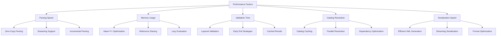

# OpenSCENARIO-rs Performance and Best Practices Guide

This guide covers performance optimization strategies, memory management techniques, and best practices for using OpenSCENARIO-rs in production environments.

## Table of Contents

1. [Performance Overview](#performance-overview)
2. [Memory Management](#memory-management)
3. [Parsing Optimization](#parsing-optimization)
4. [Catalog Performance](#catalog-performance)
5. [Validation Optimization](#validation-optimization)
6. [Serialization Performance](#serialization-performance)
7. [Scaling Strategies](#scaling-strategies)
8. [Profiling and Monitoring](#profiling-and-monitoring)
9. [Best Practices](#best-practices)

## Performance Overview

OpenSCENARIO-rs is designed for high performance with several optimization strategies built into the architecture.

### Performance Characteristics



### Benchmark Results

Typical performance characteristics on modern hardware:

| Operation | File Size | Time | Memory |
|-----------|-----------|------|--------|
| Parse Simple Scenario | 50KB | 2-5ms | 1-2MB |
| Parse Complex Scenario | 500KB | 15-30ms | 8-12MB |
| Parse Large Scenario | 5MB | 100-200ms | 50-80MB |
| Catalog Resolution | 10 catalogs | 5-15ms | 2-5MB |
| Full Validation | Complex scenario | 10-25ms | Additional 1-3MB |
| Serialize to XML | Complex scenario | 8-15ms | 2-4MB |

## Memory Management

### Zero-Copy Parsing Strategy

OpenSCENARIO-rs uses zero-copy parsing where possible to minimize memory allocations:

```rust
use openscenario_rs::{parse_str, parse_file};
use std::fs;

// Efficient file parsing - reads file once into memory
let content = fs::read_to_string("scenario.xosc")?;
let scenario = parse_str(&content)?;  // Zero-copy where possible

// Direct file parsing - optimized file reading
let scenario = parse_file("scenario.xosc")?;  // Optimized path
```

### Memory-Efficient Value<T> Usage

The `Value<T>` system is optimized for memory efficiency:

```rust
use openscenario_rs::types::{Double, OSString};

// Efficient literal creation
let speed = Double::literal(30.0);           // 24 bytes
let name = OSString::literal("vehicle".to_string()); // ~32 bytes

// Parameter references use string interning internally
let param_speed = Double::parameter("${Speed}".to_string());

// Avoid unnecessary cloning
fn process_speed(speed: &Double) {  // Use references
    if let Some(value) = speed.as_literal() {
        println!("Speed: {}", value);  // &f64, no copy
    }
}
```

### Reference Sharing

Share references to avoid unnecessary allocations:

```rust
use std::rc::Rc;
use std::sync::Arc;

// For single-threaded scenarios
type SharedScenario = Rc<OpenScenario>;

// For multi-threaded scenarios  
type SharedScenario = Arc<OpenScenario>;

fn create_shared_scenario(path: &str) -> Result<Arc<OpenScenario>> {
    let scenario = parse_file(path)?;
    Ok(Arc::new(scenario))
}

// Share scenario across multiple processors
fn process_scenario_shared(scenario: Arc<OpenScenario>) {
    // Multiple references to same scenario data
    let validation_scenario = Arc::clone(&scenario);
    let serialization_scenario = Arc::clone(&scenario);
    
    // Process concurrently without copying data
    std::thread::spawn(move || validate_scenario(&validation_scenario));
    std::thread::spawn(move || serialize_scenario(&serialization_scenario));
}
```

### Memory Pool Pattern

For high-frequency parsing, use memory pools:

```rust
use std::collections::VecDeque;

pub struct ScenarioPool {
    pool: VecDeque<OpenScenario>,
    max_size: usize,
}

impl ScenarioPool {
    pub fn new(max_size: usize) -> Self {
        Self {
            pool: VecDeque::with_capacity(max_size),
            max_size,
        }
    }
    
    pub fn get_or_parse(&mut self, xml: &str) -> Result<OpenScenario> {
        // Try to reuse existing scenario structure
        if let Some(mut scenario) = self.pool.pop_front() {
            // Reset and repopulate scenario
            self.reset_scenario(&mut scenario);
            self.populate_from_xml(&mut scenario, xml)?;
            Ok(scenario)
        } else {
            // Parse new scenario
            parse_str(xml)
        }
    }
    
    pub fn return_scenario(&mut self, scenario: OpenScenario) {
        if self.pool.len() < self.max_size {
            self.pool.push_back(scenario);
        }
        // Drop if pool is full
    }
    
    fn reset_scenario(&self, scenario: &mut OpenScenario) {
        // Clear scenario contents for reuse
        // Implementation depends on scenario structure
    }
    
    fn populate_from_xml(&self, scenario: &mut OpenScenario, xml: &str) -> Result<()> {
        // Efficiently populate existing scenario structure
        todo!()
    }
}
```

## Parsing Optimization

### Streaming Parser for Large Files

Use streaming parsing for memory-constrained environments:

```rust
use openscenario_rs::parser::streaming::StreamingParser;
use std::fs::File;

// Stream large scenario files
pub fn process_large_scenario(path: &str) -> Result<()> {
    let file = File::open(path)?;
    let mut parser = StreamingParser::new(file);
    
    // Process entities as they're parsed
    while let Some(entity) = parser.next_entity()? {
        process_entity(&entity);
        // Entity is dropped after processing, keeping memory low
    }
    
    // Process actions incrementally
    while let Some(action) = parser.next_action()? {
        process_action(&action);
    }
    
    Ok(())
}

fn process_entity(entity: &ScenarioObject) {
    // Process entity without keeping it in memory
    println!("Processing entity: {}", entity.name.as_literal().unwrap());
}

fn process_action(action: &Action) {
    // Process action without accumulating memory
    println!("Processing action");
}
```

### Incremental Parsing

Parse scenarios incrementally for better responsiveness:

```rust
pub struct IncrementalParser {
    buffer: String,
    state: ParserState,
}

enum ParserState {
    Header,
    Entities,
    Storyboard,
    Complete,
}

impl IncrementalParser {
    pub fn new() -> Self {
        Self {
            buffer: String::new(),
            state: ParserState::Header,
        }
    }
    
    pub fn feed_data(&mut self, data: &str) -> Result<Vec<ParsedElement>> {
        self.buffer.push_str(data);
        let mut results = Vec::new();
        
        while self.can_parse_next() {
            match self.state {
                ParserState::Header => {
                    if let Some(header) = self.try_parse_header()? {
                        results.push(ParsedElement::Header(header));
                        self.state = ParserState::Entities;
                    } else {
                        break;
                    }
                }
                ParserState::Entities => {
                    while let Some(entity) = self.try_parse_entity()? {
                        results.push(ParsedElement::Entity(entity));
                    }
                    if self.entities_complete() {
                        self.state = ParserState::Storyboard;
                    } else {
                        break;
                    }
                }
                ParserState::Storyboard => {
                    while let Some(action) = self.try_parse_action()? {
                        results.push(ParsedElement::Action(action));
                    }
                    if self.storyboard_complete() {
                        self.state = ParserState::Complete;
                    } else {
                        break;
                    }
                }
                ParserState::Complete => break,
            }
        }
        
        Ok(results)
    }
    
    fn can_parse_next(&self) -> bool {
        // Check if buffer contains enough data for next element
        self.buffer.len() > 1024 // Simple heuristic
    }
    
    // Implementation of parsing methods...
    fn try_parse_header(&mut self) -> Result<Option<FileHeader>> { todo!() }
    fn try_parse_entity(&mut self) -> Result<Option<ScenarioObject>> { todo!() }
    fn try_parse_action(&mut self) -> Result<Option<Action>> { todo!() }
    fn entities_complete(&self) -> bool { todo!() }
    fn storyboard_complete(&self) -> bool { todo!() }
}

pub enum ParsedElement {
    Header(FileHeader),
    Entity(ScenarioObject),
    Action(Action),
}
```

### Parser Configuration

Optimize parser settings for different use cases:

```rust
#[derive(Debug, Clone)]
pub struct ParserConfig {
    pub validate_during_parse: bool,
    pub resolve_parameters: bool,
    pub load_catalogs: bool,
    pub strict_xml_validation: bool,
    pub memory_limit: Option<usize>,
}

impl Default for ParserConfig {
    fn default() -> Self {
        Self {
            validate_during_parse: false,  // Defer validation for speed
            resolve_parameters: false,     // Lazy parameter resolution
            load_catalogs: false,         // On-demand catalog loading
            strict_xml_validation: true,
            memory_limit: None,
        }
    }
}

impl ParserConfig {
    pub fn fast() -> Self {
        Self {
            validate_during_parse: false,
            resolve_parameters: false,
            load_catalogs: false,
            strict_xml_validation: false,
            memory_limit: Some(100 * 1024 * 1024), // 100MB limit
        }
    }
    
    pub fn strict() -> Self {
        Self {
            validate_during_parse: true,
            resolve_parameters: true,
            load_catalogs: true,
            strict_xml_validation: true,
            memory_limit: None,
        }
    }
}

pub fn parse_with_config(xml: &str, config: &ParserConfig) -> Result<OpenScenario> {
    let mut parser = ConfigurableParser::new(config);
    parser.parse(xml)
}
```

## Catalog Performance

### Catalog Caching Strategy

Implement efficient catalog caching to avoid repeated parsing:

```rust
use std::collections::HashMap;
use std::time::{Instant, Duration};

pub struct CachedCatalogManager {
    cache: HashMap<String, CachedCatalog>,
    max_cache_size: usize,
    ttl: Duration,
}

struct CachedCatalog {
    catalog: CatalogFile,
    loaded_at: Instant,
    access_count: u64,
    last_accessed: Instant,
}

impl CachedCatalogManager {
    pub fn new(max_cache_size: usize, ttl: Duration) -> Self {
        Self {
            cache: HashMap::with_capacity(max_cache_size),
            max_cache_size,
            ttl,
        }
    }
    
    pub fn load_catalog(&mut self, path: &str) -> Result<&CatalogFile> {
        // Check cache first
        if let Some(cached) = self.cache.get_mut(path) {
            if cached.loaded_at.elapsed() < self.ttl {
                cached.access_count += 1;
                cached.last_accessed = Instant::now();
                return Ok(&cached.catalog);
            } else {
                // Remove expired entry
                self.cache.remove(path);
            }
        }
        
        // Load catalog from file
        let catalog = parse_catalog_from_file(path)?;
        
        // Evict old entries if cache is full
        if self.cache.len() >= self.max_cache_size {
            self.evict_lru();
        }
        
        // Add to cache
        let cached = CachedCatalog {
            catalog,
            loaded_at: Instant::now(),
            access_count: 1,
            last_accessed: Instant::now(),
        };
        
        self.cache.insert(path.to_string(), cached);
        Ok(&self.cache[path].catalog)
    }
    
    fn evict_lru(&mut self) {
        if let Some((oldest_key, _)) = self.cache
            .iter()
            .min_by_key(|(_, cached)| cached.last_accessed)
            .map(|(k, v)| (k.clone(), v.last_accessed))
        {
            self.cache.remove(&oldest_key);
        }
    }
    
    pub fn preload_catalogs(&mut self, paths: &[&str]) -> Result<()> {
        for path in paths {
            self.load_catalog(path)?;
        }
        Ok(())
    }
    
    pub fn cache_stats(&self) -> CacheStats {
        CacheStats {
            size: self.cache.len(),
            max_size: self.max_cache_size,
            hit_ratio: self.calculate_hit_ratio(),
        }
    }
    
    fn calculate_hit_ratio(&self) -> f64 {
        let total_accesses: u64 = self.cache.values().map(|c| c.access_count).sum();
        if total_accesses > 0 {
            let hits = total_accesses - self.cache.len() as u64;
            hits as f64 / total_accesses as f64
        } else {
            0.0
        }
    }
}

#[derive(Debug)]
pub struct CacheStats {
    pub size: usize,
    pub max_size: usize,
    pub hit_ratio: f64,
}
```

### Parallel Catalog Resolution

Resolve multiple catalog references concurrently:

```rust
use std::sync::Arc;
use tokio::task::JoinSet;

pub struct ParallelCatalogResolver {
    catalog_manager: Arc<CachedCatalogManager>,
    max_concurrent: usize,
}

impl ParallelCatalogResolver {
    pub fn new(catalog_manager: Arc<CachedCatalogManager>, max_concurrent: usize) -> Self {
        Self {
            catalog_manager,
            max_concurrent,
        }
    }
    
    pub async fn resolve_all_references(
        &self,
        references: Vec<CatalogReference>
    ) -> Result<Vec<ResolvedCatalogEntry>> {
        let mut join_set = JoinSet::new();
        let mut results = Vec::with_capacity(references.len());
        
        // Process references in batches to limit concurrency
        for chunk in references.chunks(self.max_concurrent) {
            for reference in chunk {
                let manager = Arc::clone(&self.catalog_manager);
                let ref_clone = reference.clone();
                
                join_set.spawn(async move {
                    Self::resolve_single_reference(manager, ref_clone).await
                });
            }
            
            // Wait for batch to complete
            while let Some(result) = join_set.join_next().await {
                results.push(result??);
            }
        }
        
        Ok(results)
    }
    
    async fn resolve_single_reference(
        manager: Arc<CachedCatalogManager>,
        reference: CatalogReference
    ) -> Result<ResolvedCatalogEntry> {
        // Spawn blocking task for I/O
        tokio::task::spawn_blocking(move || {
            let mut manager = manager.lock().unwrap();
            manager.resolve_reference(&reference)
        }).await?
    }
}

// Usage example
async fn resolve_scenario_catalogs(scenario: &OpenScenario) -> Result<()> {
    let catalog_manager = Arc::new(CachedCatalogManager::new(100, Duration::from_secs(300)));
    let resolver = ParallelCatalogResolver::new(catalog_manager, 4);
    
    // Collect all catalog references
    let mut references = Vec::new();
    collect_catalog_references(scenario, &mut references);
    
    // Resolve in parallel
    let resolved = resolver.resolve_all_references(references).await?;
    
    println!("Resolved {} catalog entries", resolved.len());
    Ok(())
}
```

### Catalog Dependency Optimization

Optimize catalog loading order based on dependencies:

```rust
use petgraph::{Graph, Direction};
use petgraph::graph::NodeIndex;

pub struct CatalogDependencyManager {
    dependency_graph: Graph<String, ()>,
    node_indices: HashMap<String, NodeIndex>,
}

impl CatalogDependencyManager {
    pub fn new() -> Self {
        Self {
            dependency_graph: Graph::new(),
            node_indices: HashMap::new(),
        }
    }
    
    pub fn add_catalog(&mut self, catalog_name: String) {
        if !self.node_indices.contains_key(&catalog_name) {
            let index = self.dependency_graph.add_node(catalog_name.clone());
            self.node_indices.insert(catalog_name, index);
        }
    }
    
    pub fn add_dependency(&mut self, dependent: &str, dependency: &str) {
        self.add_catalog(dependent.to_string());
        self.add_catalog(dependency.to_string());
        
        let dependent_idx = self.node_indices[dependent];
        let dependency_idx = self.node_indices[dependency];
        
        self.dependency_graph.add_edge(dependency_idx, dependent_idx, ());
    }
    
    pub fn get_load_order(&self) -> Result<Vec<String>, String> {
        // Topological sort to determine optimal load order
        match petgraph::algo::toposort(&self.dependency_graph, None) {
            Ok(indices) => {
                Ok(indices
                    .into_iter()
                    .map(|idx| self.dependency_graph[idx].clone())
                    .collect())
            }
            Err(_) => Err("Circular dependency detected in catalogs".to_string()),
        }
    }
    
    pub fn analyze_dependencies(&self, catalog_name: &str) -> Option<DependencyAnalysis> {
        let node_idx = self.node_indices.get(catalog_name)?;
        
        let dependencies: Vec<String> = self.dependency_graph
            .neighbors_directed(*node_idx, Direction::Incoming)
            .map(|idx| self.dependency_graph[idx].clone())
            .collect();
            
        let dependents: Vec<String> = self.dependency_graph
            .neighbors_directed(*node_idx, Direction::Outgoing)
            .map(|idx| self.dependency_graph[idx].clone())
            .collect();
        
        Some(DependencyAnalysis {
            catalog: catalog_name.to_string(),
            dependencies,
            dependents,
            depth: self.calculate_depth(*node_idx),
        })
    }
    
    fn calculate_depth(&self, node_idx: NodeIndex) -> usize {
        // Calculate maximum depth from root nodes
        // Implementation would use graph traversal
        0
    }
}

#[derive(Debug)]
pub struct DependencyAnalysis {
    pub catalog: String,
    pub dependencies: Vec<String>,
    pub dependents: Vec<String>,
    pub depth: usize,
}
```

## Validation Optimization

### Lazy Validation Strategy

Implement lazy validation to improve startup performance:

```rust
pub struct LazyValidator {
    validation_cache: HashMap<String, ValidationResult>,
    validation_level: ValidationLevel,
}

enum ValidationResult {
    Valid,
    Invalid(Vec<ValidationError>),
    Pending,
}

impl LazyValidator {
    pub fn new(level: ValidationLevel) -> Self {
        Self {
            validation_cache: HashMap::new(),
            validation_level: level,
        }
    }
    
    pub fn validate_on_access<T>(&mut self, item: &T, key: &str) -> Result<()>
    where
        T: Validate + Hash,
    {
        match self.validation_cache.get(key) {
            Some(ValidationResult::Valid) => Ok(()),
            Some(ValidationResult::Invalid(errors)) => {
                Err(errors[0].clone().into()) // Return first error
            }
            Some(ValidationResult::Pending) | None => {
                // Perform validation
                self.validation_cache.insert(key.to_string(), ValidationResult::Pending);
                
                match self.perform_validation(item) {
                    Ok(_) => {
                        self.validation_cache.insert(key.to_string(), ValidationResult::Valid);
                        Ok(())
                    }
                    Err(errors) => {
                        self.validation_cache.insert(
                            key.to_string(),
                            ValidationResult::Invalid(errors.clone())
                        );
                        Err(errors[0].clone().into())
                    }
                }
            }
        }
    }
    
    fn perform_validation<T: Validate>(&self, item: &T) -> Result<(), Vec<ValidationError>> {
        let context = ValidationContext::new();
        match item.validate(&context) {
            Ok(_) => Ok(()),
            Err(e) => Err(vec![ValidationError::from(e)]),
        }
    }
    
    pub fn prevalidate_batch<T>(&mut self, items: &[(T, String)]) -> usize
    where
        T: Validate + Hash,
    {
        let mut validated_count = 0;
        
        for (item, key) in items {
            if !self.validation_cache.contains_key(key) {
                if self.validate_on_access(item, key).is_ok() {
                    validated_count += 1;
                }
            }
        }
        
        validated_count
    }
}
```

### Validation Pipeline Optimization

Optimize validation pipeline for better performance:

```rust
pub struct OptimizedValidationPipeline {
    fast_validators: Vec<Box<dyn FastValidator>>,
    detailed_validators: Vec<Box<dyn DetailedValidator>>,
    parallel_threshold: usize,
}

trait FastValidator: Send + Sync {
    fn quick_validate(&self, scenario: &OpenScenario) -> bool;
    fn name(&self) -> &str;
}

trait DetailedValidator: Send + Sync {
    fn detailed_validate(&self, scenario: &OpenScenario) -> ValidationReport;
    fn name(&self) -> &str;
}

impl OptimizedValidationPipeline {
    pub fn new(parallel_threshold: usize) -> Self {
        Self {
            fast_validators: Vec::new(),
            detailed_validators: Vec::new(),
            parallel_threshold,
        }
    }
    
    pub fn add_fast_validator(&mut self, validator: Box<dyn FastValidator>) {
        self.fast_validators.push(validator);
    }
    
    pub fn add_detailed_validator(&mut self, validator: Box<dyn DetailedValidator>) {
        self.detailed_validators.push(validator);
    }
    
    pub fn validate(&self, scenario: &OpenScenario) -> ValidationReport {
        // Fast validation first - fail fast
        for validator in &self.fast_validators {
            if !validator.quick_validate(scenario) {
                return ValidationReport::fast_fail(validator.name());
            }
        }
        
        // Detailed validation
        if self.detailed_validators.len() > self.parallel_threshold {
            self.validate_parallel(scenario)
        } else {
            self.validate_sequential(scenario)
        }
    }
    
    fn validate_parallel(&self, scenario: &OpenScenario) -> ValidationReport {
        use rayon::prelude::*;
        
        let reports: Vec<ValidationReport> = self.detailed_validators
            .par_iter()
            .map(|validator| validator.detailed_validate(scenario))
            .collect();
        
        ValidationReport::merge(reports)
    }
    
    fn validate_sequential(&self, scenario: &OpenScenario) -> ValidationReport {
        let mut combined_report = ValidationReport::new();
        
        for validator in &self.detailed_validators {
            let report = validator.detailed_validate(scenario);
            combined_report.merge_in_place(report);
            
            // Early exit on critical errors
            if combined_report.has_critical_errors() {
                break;
            }
        }
        
        combined_report
    }
}

// Example fast validator
pub struct SchemaFastValidator;

impl FastValidator for SchemaFastValidator {
    fn quick_validate(&self, scenario: &OpenScenario) -> bool {
        // Quick schema checks
        scenario.file_header.author.as_literal().is_some() &&
        scenario.file_header.description.as_literal().is_some()
    }
    
    fn name(&self) -> &str {
        "schema_fast"
    }
}
```

## Serialization Performance

### Efficient XML Generation

Optimize XML serialization for better performance:

```rust
use quick_xml::Writer;
use std::io::{BufWriter, Write};

pub struct OptimizedXmlSerializer {
    buffer_size: usize,
    pretty_print: bool,
    validate_output: bool,
}

impl OptimizedXmlSerializer {
    pub fn new() -> Self {
        Self {
            buffer_size: 64 * 1024, // 64KB buffer
            pretty_print: false,     // Faster without formatting
            validate_output: false,  // Skip validation in production
        }
    }
    
    pub fn with_buffer_size(mut self, size: usize) -> Self {
        self.buffer_size = size;
        self
    }
    
    pub fn with_pretty_print(mut self, pretty: bool) -> Self {
        self.pretty_print = pretty;
        self
    }
    
    pub fn serialize_to_writer<W: Write>(&self, scenario: &OpenScenario, writer: W) -> Result<()> {
        let mut buf_writer = BufWriter::with_capacity(self.buffer_size, writer);
        let mut xml_writer = Writer::new(&mut buf_writer);
        
        if self.pretty_print {
            xml_writer = xml_writer.with_indent(b"  ");
        }
        
        // Serialize scenario elements efficiently
        self.serialize_scenario_fast(scenario, &mut xml_writer)?;
        buf_writer.flush()?;
        
        Ok(())
    }
    
    fn serialize_scenario_fast<W: Write>(
        &self,
        scenario: &OpenScenario,
        writer: &mut Writer<W>
    ) -> Result<()> {
        // Custom serialization that avoids intermediate allocations
        
        // Write XML declaration
        writer.write_event(quick_xml::events::Event::Decl(
            quick_xml::events::BytesDecl::new("1.0", Some("UTF-8"), None)
        ))?;
        
        // Write root element
        let mut root_start = quick_xml::events::BytesStart::new("OpenSCENARIO");
        root_start.push_attribute(("xmlns", "http://www.openscenario.org/OpenSCENARIO"));
        writer.write_event(quick_xml::events::Event::Start(root_start))?;
        
        // Serialize file header efficiently
        self.serialize_file_header(&scenario.file_header, writer)?;
        
        // Serialize other elements...
        if let Some(entities) = &scenario.entities {
            self.serialize_entities(entities, writer)?;
        }
        
        if let Some(storyboard) = &scenario.storyboard {
            self.serialize_storyboard(storyboard, writer)?;
        }
        
        // Close root element
        writer.write_event(quick_xml::events::Event::End(
            quick_xml::events::BytesEnd::new("OpenSCENARIO")
        ))?;
        
        Ok(())
    }
    
    fn serialize_file_header<W: Write>(
        &self,
        header: &FileHeader,
        writer: &mut Writer<W>
    ) -> Result<()> {
        let mut start = quick_xml::events::BytesStart::new("FileHeader");
        
        // Efficiently write attributes
        if let Some(author) = header.author.as_literal() {
            start.push_attribute(("author", author.as_str()));
        }
        if let Some(description) = header.description.as_literal() {
            start.push_attribute(("description", description.as_str()));
        }
        // Add other attributes...
        
        writer.write_event(quick_xml::events::Event::Empty(start))?;
        Ok(())
    }
    
    // Additional serialization methods...
    fn serialize_entities<W: Write>(&self, entities: &Entities, writer: &mut Writer<W>) -> Result<()> {
        todo!()
    }
    
    fn serialize_storyboard<W: Write>(&self, storyboard: &Storyboard, writer: &mut Writer<W>) -> Result<()> {
        todo!()
    }
}
```

### Streaming Serialization

Implement streaming serialization for large scenarios:

```rust
pub struct StreamingSerializer<W: Write> {
    writer: Writer<BufWriter<W>>,
    state: SerializationState,
}

enum SerializationState {
    Initial,
    Header,
    Entities,
    Storyboard,
    Complete,
}

impl<W: Write> StreamingSerializer<W> {
    pub fn new(writer: W) -> Self {
        let buf_writer = BufWriter::with_capacity(64 * 1024, writer);
        let xml_writer = Writer::new(buf_writer);
        
        Self {
            writer: xml_writer,
            state: SerializationState::Initial,
        }
    }
    
    pub fn start_document(&mut self) -> Result<()> {
        match self.state {
            SerializationState::Initial => {
                self.writer.write_event(quick_xml::events::Event::Decl(
                    quick_xml::events::BytesDecl::new("1.0", Some("UTF-8"), None)
                ))?;
                
                let mut root = quick_xml::events::BytesStart::new("OpenSCENARIO");
                root.push_attribute(("xmlns", "http://www.openscenario.org/OpenSCENARIO"));
                self.writer.write_event(quick_xml::events::Event::Start(root))?;
                
                self.state = SerializationState::Header;
                Ok(())
            }
            _ => Err(Error::validation_error("serialization", "Document already started")),
        }
    }
    
    pub fn write_header(&mut self, header: &FileHeader) -> Result<()> {
        match self.state {
            SerializationState::Header => {
                self.serialize_header(header)?;
                self.state = SerializationState::Entities;
                Ok(())
            }
            _ => Err(Error::validation_error("serialization", "Invalid state for header")),
        }
    }
    
    pub fn write_entity(&mut self, entity: &ScenarioObject) -> Result<()> {
        match self.state {
            SerializationState::Entities => {
                self.serialize_entity(entity)?;
                Ok(())
            }
            _ => Err(Error::validation_error("serialization", "Invalid state for entity")),
        }
    }
    
    pub fn finish_document(mut self) -> Result<W> {
        match self.state {
            SerializationState::Complete => {},
            _ => {
                self.writer.write_event(quick_xml::events::Event::End(
                    quick_xml::events::BytesEnd::new("OpenSCENARIO")
                ))?;
                self.state = SerializationState::Complete;
            }
        }
        
        // Extract the underlying writer
        let buf_writer = self.writer.into_inner();
        Ok(buf_writer.into_inner().map_err(|e| e.into_error())?)
    }
    
    fn serialize_header(&mut self, header: &FileHeader) -> Result<()> {
        // Implementation for header serialization
        todo!()
    }
    
    fn serialize_entity(&mut self, entity: &ScenarioObject) -> Result<()> {
        // Implementation for entity serialization
        todo!()
    }
}

// Usage example
fn stream_large_scenario(scenario: &OpenScenario, output: File) -> Result<()> {
    let mut serializer = StreamingSerializer::new(output);
    
    serializer.start_document()?;
    serializer.write_header(&scenario.file_header)?;
    
    if let Some(entities) = &scenario.entities {
        for entity in &entities.scenario_objects {
            serializer.write_entity(entity)?;
        }
    }
    
    serializer.finish_document()?;
    Ok(())
}
```

## Scaling Strategies

### Horizontal Scaling

Design patterns for processing multiple scenarios concurrently:

```rust
use tokio::sync::Semaphore;
use std::sync::Arc;

pub struct ScenarioProcessor {
    semaphore: Arc<Semaphore>,
    catalog_manager: Arc<CachedCatalogManager>,
}

impl ScenarioProcessor {
    pub fn new(max_concurrent: usize) -> Self {
        Self {
            semaphore: Arc::new(Semaphore::new(max_concurrent)),
            catalog_manager: Arc::new(CachedCatalogManager::new(100, Duration::from_secs(300))),
        }
    }
    
    pub async fn process_scenarios_batch(
        &self,
        scenario_paths: Vec<String>
    ) -> Result<Vec<ProcessingResult>> {
        let mut tasks = Vec::new();
        
        for path in scenario_paths {
            let permit = Arc::clone(&self.semaphore);
            let catalog_manager = Arc::clone(&self.catalog_manager);
            
            let task = tokio::spawn(async move {
                let _permit = permit.acquire().await.unwrap();
                Self::process_single_scenario(path, catalog_manager).await
            });
            
            tasks.push(task);
        }
        
        // Collect all results
        let mut results = Vec::new();
        for task in tasks {
            results.push(task.await??);
        }
        
        Ok(results)
    }
    
    async fn process_single_scenario(
        path: String,
        catalog_manager: Arc<CachedCatalogManager>
    ) -> Result<ProcessingResult> {
        // Process scenario in background task
        tokio::task::spawn_blocking(move || {
            let start_time = Instant::now();
            
            // Parse scenario
            let scenario = parse_file(&path)?;
            let parse_time = start_time.elapsed();
            
            // Resolve catalogs
            let catalog_start = Instant::now();
            let mut manager = catalog_manager.lock().unwrap();
            // Catalog resolution logic...
            let catalog_time = catalog_start.elapsed();
            
            // Validate scenario
            let validation_start = Instant::now();
            let validation_context = ValidationContext::new();
            scenario.validate(&validation_context)?;
            let validation_time = validation_start.elapsed();
            
            Ok(ProcessingResult {
                path,
                parse_time,
                catalog_time,
                validation_time,
                total_time: start_time.elapsed(),
                success: true,
                error: None,
            })
        }).await?
    }
}

#[derive(Debug)]
pub struct ProcessingResult {
    pub path: String,
    pub parse_time: Duration,
    pub catalog_time: Duration,
    pub validation_time: Duration,
    pub total_time: Duration,
    pub success: bool,
    pub error: Option<String>,
}
```

### Memory-Constrained Environments

Optimize for environments with limited memory:

```rust
pub struct LowMemoryProcessor {
    memory_limit: usize,
    current_usage: Arc<AtomicUsize>,
    processing_queue: VecDeque<String>,
}

impl LowMemoryProcessor {
    pub fn new(memory_limit_mb: usize) -> Self {
        Self {
            memory_limit: memory_limit_mb * 1024 * 1024,
            current_usage: Arc::new(AtomicUsize::new(0)),
            processing_queue: VecDeque::new(),
        }
    }
    
    pub fn process_scenario_stream(&mut self, scenario_paths: Vec<String>) -> Result<()> {
        self.processing_queue.extend(scenario_paths);
        
        while let Some(path) = self.processing_queue.pop_front() {
            // Check memory usage before processing
            if self.current_usage.load(Ordering::Relaxed) > self.memory_limit {
                // Wait for memory to be freed or trigger GC
                self.wait_for_memory()?;
            }
            
            self.process_single_with_memory_tracking(&path)?;
        }
        
        Ok(())
    }
    
    fn process_single_with_memory_tracking(&self, path: &str) -> Result<()> {
        let _memory_guard = MemoryGuard::new(Arc::clone(&self.current_usage));
        
        // Use streaming parser to minimize memory usage
        let file = File::open(path)?;
        let mut parser = StreamingParser::new(file);
        
        // Process incrementally
        while let Some(element) = parser.next_element()? {
            self.process_element(element)?;
            
            // Check memory periodically
            if _memory_guard.current_usage() > self.memory_limit {
                return Err(Error::validation_error(
                    "memory",
                    "Memory limit exceeded during processing"
                ));
            }
        }
        
        Ok(())
    }
    
    fn wait_for_memory(&self) -> Result<()> {
        // Force garbage collection or wait for memory to be freed
        std::thread::sleep(Duration::from_millis(100));
        
        // Check if memory is still too high
        if self.current_usage.load(Ordering::Relaxed) > self.memory_limit {
            Err(Error::validation_error("memory", "Insufficient memory available"))
        } else {
            Ok(())
        }
    }
    
    fn process_element(&self, element: ParsedElement) -> Result<()> {
        // Process element and immediately drop to free memory
        match element {
            ParsedElement::Entity(entity) => {
                self.validate_entity(&entity)?;
                // Entity is dropped here
            }
            ParsedElement::Action(action) => {
                self.validate_action(&action)?;
                // Action is dropped here
            }
            _ => {}
        }
        Ok(())
    }
    
    fn validate_entity(&self, entity: &ScenarioObject) -> Result<()> {
        // Minimal validation to reduce memory overhead
        if entity.name.as_literal().is_none() {
            return Err(Error::validation_error("entity", "Entity name is required"));
        }
        Ok(())
    }
    
    fn validate_action(&self, action: &Action) -> Result<()> {
        // Basic action validation
        Ok(())
    }
}

struct MemoryGuard {
    usage_counter: Arc<AtomicUsize>,
    initial_usage: usize,
}

impl MemoryGuard {
    fn new(usage_counter: Arc<AtomicUsize>) -> Self {
        let initial_usage = usage_counter.load(Ordering::Relaxed);
        Self {
            usage_counter,
            initial_usage,
        }
    }
    
    fn current_usage(&self) -> usize {
        self.usage_counter.load(Ordering::Relaxed)
    }
}

impl Drop for MemoryGuard {
    fn drop(&mut self) {
        // Reset usage to initial value when guard is dropped
        self.usage_counter.store(self.initial_usage, Ordering::Relaxed);
    }
}
```

## Profiling and Monitoring

### Performance Monitoring

Implement comprehensive performance monitoring:

```rust
use std::time::{Duration, Instant};
use std::collections::HashMap;

pub struct PerformanceMonitor {
    metrics: HashMap<String, Metric>,
    start_times: HashMap<String, Instant>,
}

#[derive(Debug, Clone)]
pub struct Metric {
    pub total_time: Duration,
    pub call_count: u64,
    pub min_time: Duration,
    pub max_time: Duration,
    pub avg_time: Duration,
}

impl PerformanceMonitor {
    pub fn new() -> Self {
        Self {
            metrics: HashMap::new(),
            start_times: HashMap::new(),
        }
    }
    
    pub fn start_timer(&mut self, operation: &str) {
        self.start_times.insert(operation.to_string(), Instant::now());
    }
    
    pub fn end_timer(&mut self, operation: &str) {
        if let Some(start_time) = self.start_times.remove(operation) {
            let duration = start_time.elapsed();
            self.record_measurement(operation, duration);
        }
    }
    
    pub fn record_measurement(&mut self, operation: &str, duration: Duration) {
        let metric = self.metrics.entry(operation.to_string()).or_insert(Metric {
            total_time: Duration::ZERO,
            call_count: 0,
            min_time: duration,
            max_time: duration,
            avg_time: Duration::ZERO,
        });
        
        metric.total_time += duration;
        metric.call_count += 1;
        metric.min_time = metric.min_time.min(duration);
        metric.max_time = metric.max_time.max(duration);
        metric.avg_time = metric.total_time / metric.call_count as u32;
    }
    
    pub fn get_metric(&self, operation: &str) -> Option<&Metric> {
        self.metrics.get(operation)
    }
    
    pub fn print_report(&self) {
        println!("Performance Report:");
        println!("{:<30} {:>10} {:>15} {:>15} {:>15} {:>15}", 
                 "Operation", "Calls", "Total (ms)", "Avg (ms)", "Min (ms)", "Max (ms)");
        println!("{:-<100}", "");
        
        for (operation, metric) in &self.metrics {
            println!("{:<30} {:>10} {:>15.2} {:>15.2} {:>15.2} {:>15.2}",
                     operation,
                     metric.call_count,
                     metric.total_time.as_millis(),
                     metric.avg_time.as_millis(),
                     metric.min_time.as_millis(),
                     metric.max_time.as_millis());
        }
    }
}

// Usage with RAII timer
pub struct TimedOperation<'a> {
    monitor: &'a mut PerformanceMonitor,
    operation: String,
}

impl<'a> TimedOperation<'a> {
    pub fn new(monitor: &'a mut PerformanceMonitor, operation: &str) -> Self {
        monitor.start_timer(operation);
        Self {
            monitor,
            operation: operation.to_string(),
        }
    }
}

impl<'a> Drop for TimedOperation<'a> {
    fn drop(&mut self) {
        self.monitor.end_timer(&self.operation);
    }
}

// Example usage
fn monitored_scenario_processing() -> Result<()> {
    let mut monitor = PerformanceMonitor::new();
    
    {
        let _timer = TimedOperation::new(&mut monitor, "parse_scenario");
        let scenario = parse_file("scenario.xosc")?;
    }
    
    {
        let _timer = TimedOperation::new(&mut monitor, "validate_scenario");
        // Validation logic...
    }
    
    {
        let _timer = TimedOperation::new(&mut monitor, "serialize_scenario");
        // Serialization logic...
    }
    
    monitor.print_report();
    Ok(())
}
```

### Resource Usage Tracking

Track resource usage during scenario processing:

```rust
use procfs::process::Process;

pub struct ResourceTracker {
    process: Process,
    initial_memory: u64,
    peak_memory: u64,
    samples: Vec<ResourceSample>,
}

#[derive(Debug, Clone)]
pub struct ResourceSample {
    pub timestamp: Instant,
    pub memory_usage: u64,
    pub cpu_usage: f64,
    pub file_descriptors: u64,
}

impl ResourceTracker {
    pub fn new() -> Result<Self> {
        let process = Process::myself()?;
        let initial_memory = process.stat()?.rss * 1024; // Convert to bytes
        
        Ok(Self {
            process,
            initial_memory,
            peak_memory: initial_memory,
            samples: Vec::new(),
        })
    }
    
    pub fn sample(&mut self) -> Result<()> {
        let stat = self.process.stat()?;
        let status = self.process.status()?;
        
        let memory_usage = stat.rss * 1024; // RSS in bytes
        self.peak_memory = self.peak_memory.max(memory_usage);
        
        let sample = ResourceSample {
            timestamp: Instant::now(),
            memory_usage,
            cpu_usage: 0.0, // Would need more sophisticated CPU calculation
            file_descriptors: status.fdsize,
        };
        
        self.samples.push(sample);
        Ok(())
    }
    
    pub fn memory_growth(&self) -> u64 {
        self.peak_memory.saturating_sub(self.initial_memory)
    }
    
    pub fn current_memory(&self) -> Result<u64> {
        Ok(self.process.stat()?.rss * 1024)
    }
    
    pub fn generate_report(&self) -> ResourceReport {
        let avg_memory = self.samples.iter()
            .map(|s| s.memory_usage)
            .sum::<u64>() / self.samples.len() as u64;
            
        ResourceReport {
            initial_memory: self.initial_memory,
            peak_memory: self.peak_memory,
            average_memory: avg_memory,
            memory_growth: self.memory_growth(),
            sample_count: self.samples.len(),
        }
    }
}

#[derive(Debug)]
pub struct ResourceReport {
    pub initial_memory: u64,
    pub peak_memory: u64,
    pub average_memory: u64,
    pub memory_growth: u64,
    pub sample_count: usize,
}

impl ResourceReport {
    pub fn print(&self) {
        println!("Resource Usage Report:");
        println!("Initial Memory: {:.2} MB", self.initial_memory as f64 / 1024.0 / 1024.0);
        println!("Peak Memory: {:.2} MB", self.peak_memory as f64 / 1024.0 / 1024.0);
        println!("Average Memory: {:.2} MB", self.average_memory as f64 / 1024.0 / 1024.0);
        println!("Memory Growth: {:.2} MB", self.memory_growth as f64 / 1024.0 / 1024.0);
        println!("Samples Collected: {}", self.sample_count);
    }
}
```

## Best Practices

### 1. Choose the Right API Level

```rust
// For simple, one-off parsing
let scenario = parse_file("scenario.xosc")?;

// For repeated parsing with validation
let mut parser = ConfigurableParser::new(&ParserConfig::default());
let scenario = parser.parse_file("scenario.xosc")?;

// For high-performance batch processing
let processor = ScenarioProcessor::new(4); // 4 concurrent workers
let results = processor.process_scenarios_batch(file_paths).await?;

// For memory-constrained environments
let mut low_mem_processor = LowMemoryProcessor::new(100); // 100MB limit
low_mem_processor.process_scenario_stream(file_paths)?;
```

### 2. Memory Management Guidelines

```rust
// ✅ Good: Use references to avoid copying
fn process_entities(entities: &Entities) {
    for entity in &entities.scenario_objects {
        process_entity(entity); // Pass by reference
    }
}

// ❌ Bad: Unnecessary cloning
fn process_entities_bad(entities: &Entities) {
    for entity in &entities.scenario_objects {
        let entity_copy = entity.clone(); // Unnecessary allocation
        process_entity_copy(entity_copy);
    }
}

// ✅ Good: Extract values without cloning
if let Some(speed) = speed_action.value.as_literal() {
    println!("Speed: {}", speed); // &f64, no allocation
}

// ❌ Bad: Clone for simple access
let speed_value = speed_action.value.as_literal().unwrap().clone(); // Unnecessary
```

### 3. Error Handling Performance

```rust
// ✅ Good: Early return on critical errors
fn validate_scenario_fast(scenario: &OpenScenario) -> Result<()> {
    // Check critical errors first
    if scenario.file_header.author.as_literal().is_none() {
        return Err(Error::validation_error("author", "Author is required"));
    }
    
    // Continue with detailed validation only if basics pass
    validate_detailed(scenario)
}

// ✅ Good: Batch error collection for comprehensive validation
fn validate_scenario_comprehensive(scenario: &OpenScenario) -> ValidationReport {
    let mut errors = Vec::new();
    
    // Collect all errors, don't stop at first
    if let Err(e) = validate_header(&scenario.file_header) {
        errors.push(e);
    }
    
    if let Err(e) = validate_entities(&scenario.entities) {
        errors.push(e);
    }
    
    ValidationReport { errors }
}
```

### 4. Catalog Optimization

```rust
// ✅ Good: Preload catalogs for batch processing
let mut catalog_manager = CachedCatalogManager::new(100, Duration::from_secs(300));
catalog_manager.preload_catalogs(&catalog_paths)?;

// Process multiple scenarios with cached catalogs
for scenario_path in scenario_paths {
    let scenario = parse_file(&scenario_path)?;
    resolve_scenario_catalogs(&scenario, &mut catalog_manager)?;
}

// ✅ Good: Use dependency-aware loading
let mut dependency_manager = CatalogDependencyManager::new();
build_dependency_graph(&mut dependency_manager, &catalog_locations);
let load_order = dependency_manager.get_load_order()?;

for catalog in load_order {
    catalog_manager.load_catalog(&catalog)?;
}
```

This performance guide provides comprehensive strategies for optimizing OpenSCENARIO-rs usage in production environments, covering all aspects from parsing to serialization and scaling considerations.