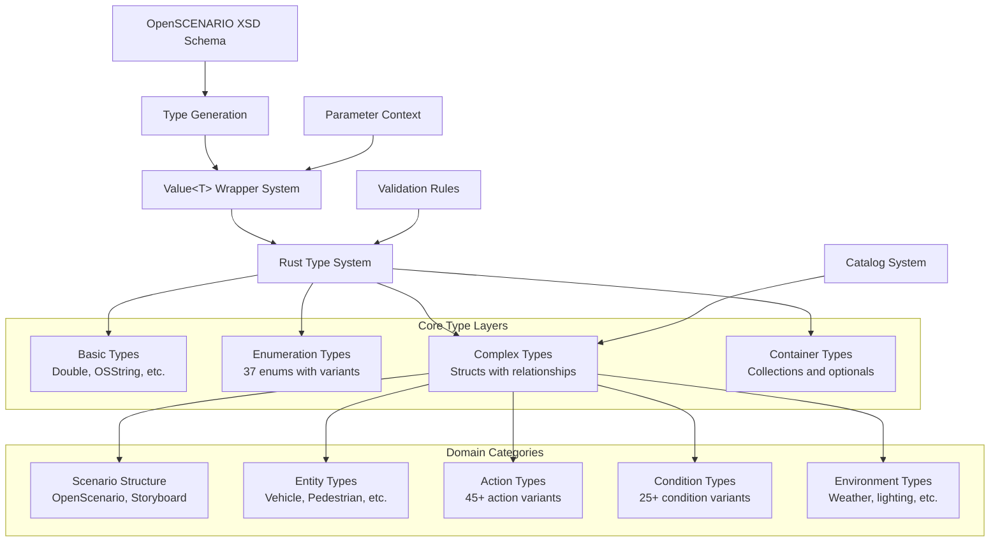

# OpenSCENARIO-rs Type System Guide

This guide provides a comprehensive overview of the OpenSCENARIO-rs type system, explaining how the library maps the OpenSCENARIO XSD schema to Rust types, handles parameterization, and ensures type safety.

## Table of Contents

1. [Type System Overview](#type-system-overview)
2. [Value<T> System](#valuet-system)
3. [Schema Mapping](#schema-mapping)
4. [Parameterization](#parameterization)
5. [Type Categories](#type-categories)
6. [Serialization](#serialization)
7. [Validation](#validation)
8. [Extension Points](#extension-points)

## Type System Overview

The OpenSCENARIO-rs type system is designed to provide complete, type-safe access to all OpenSCENARIO specification elements while supporting the standard's parameterization features.

### Design Principles

1. **Complete Coverage** - All 347+ OpenSCENARIO types are represented
2. **Type Safety** - Rust's type system prevents invalid scenarios at compile time
3. **Parameterization** - Native support for `${parameter}` references
4. **Schema Compliance** - Direct mapping to OpenSCENARIO XSD structure
5. **Performance** - Zero-copy parsing and efficient serialization

### Architecture Diagram



## Value<T> System

The `Value<T>` system is the foundation of OpenSCENARIO-rs parameterization support.

### Core Concept

Every field that can contain a parameter reference in OpenSCENARIO is wrapped in a `Value<T>` type:

```rust
// XSD: <xs:attribute name="speed" type="Double" use="required"/>
// Rust: pub speed: Double,  // where Double = Value<f64>
```

### Value<T> Implementation

```rust
#[derive(Debug, Clone, PartialEq, Serialize, Deserialize)]
pub enum Value<T> {
    /// A literal value (e.g., "30.0", "vehicle_name")
    Literal(T),
    /// A parameter reference (e.g., "${Speed}", "${$VehicleName}")
    Parameter(String),
}

impl<T> Value<T> {
    /// Create a literal value
    pub fn literal(value: T) -> Self {
        Value::Literal(value)
    }
    
    /// Create a parameter reference
    pub fn parameter(param_ref: String) -> Self {
        Value::Parameter(param_ref)
    }
    
    /// Get the literal value if this is not a parameter
    pub fn as_literal(&self) -> Option<&T> {
        match self {
            Value::Literal(value) => Some(value),
            Value::Parameter(_) => None,
        }
    }
    
    /// Check if this is a literal value
    pub fn is_literal(&self) -> bool {
        matches!(self, Value::Literal(_))
    }
    
    /// Check if this is a parameter reference
    pub fn is_parameter(&self) -> bool {
        matches!(self, Value::Parameter(_))
    }
    
    /// Get the parameter name if this is a parameter reference
    pub fn parameter_name(&self) -> Option<&str> {
        match self {
            Value::Parameter(param) => Some(param),
            Value::Literal(_) => None,
        }
    }
}
```

### Type Aliases

Common `Value<T>` types have convenient aliases:

```rust
pub type Double = Value<f64>;           // Floating-point numbers
pub type OSString = Value<String>;      // String values
pub type UnsignedInt = Value<u32>;      // Unsigned integers
pub type UnsignedShort = Value<u16>;    // Short unsigned integers
pub type Int = Value<i32>;              // Signed integers
pub type Boolean = Value<bool>;         // Boolean values
```

### Usage Examples

```rust
use openscenario_rs::types::{Double, OSString};

// Create literal values
let speed = Double::literal(30.0);
let vehicle_name = OSString::literal("ego_vehicle".to_string());

// Create parameter references
let param_speed = Double::parameter("${TargetSpeed}".to_string());
let param_name = OSString::parameter("${VehicleName}".to_string());

// Access values safely
if let Some(speed_value) = speed.as_literal() {
    println!("Speed: {} m/s", speed_value);
}

// Check parameter status
if param_speed.is_parameter() {
    println!("Speed is parameterized: {}", param_speed.parameter_name().unwrap());
}

// Resolution (requires parameter context)
let mut parameters = std::collections::HashMap::new();
parameters.insert("TargetSpeed".to_string(), "45.0".to_string());

let resolved_speed: f64 = param_speed.resolve(&parameters)?;
```

## Schema Mapping

The library provides a direct mapping from OpenSCENARIO XSD schema to Rust types.

### Mapping Rules

| XSD Type | Rust Type | Notes |
|----------|-----------|-------|
| `xs:double` | `Double` (Value<f64>) | Parameterizable floating-point |
| `xs:string` | `OSString` (Value<String>) | Parameterizable string |
| `xs:unsignedInt` | `UnsignedInt` (Value<u32>) | Parameterizable unsigned integer |
| `xs:unsignedShort` | `UnsignedShort` (Value<u16>) | Parameterizable unsigned short |
| `xs:int` | `Int` (Value<i32>) | Parameterizable signed integer |
| `xs:boolean` | `Boolean` (Value<bool>) | Parameterizable boolean |
| `xs:enumeration` | `enum` | Rust enum with variants |
| `xs:complexType` | `struct` | Rust struct with fields |

### Schema Relationships

```mermaid
graph TD
    A[XSD Schema Element] --> B{Element Type}
    
    B -->|Simple Type| C[Value&lt;T&gt; Wrapper]
    B -->|Complex Type| D[Rust Struct]
    B -->|Enumeration| E[Rust Enum]
    
    C --> F[Basic Type Mapping]
    D --> G[Field Generation]
    E --> H[Variant Generation]
    
    G --> I[Required Fields]
    G --> J[Optional Fields - Option&lt;T&gt;]
    G --> K[Collections - Vec&lt;T&gt;]
    
    F --> L[Type Alias Creation]
    H --> M[String Serialization]
    
    subgraph "Serialization Attributes"
        N[#[serde(rename = "xmlName")]]
        O[#[serde(skip_serializing_if = "Option::is_none")]]
        P[#[serde(flatten)]]
    end
    
    D --> N
    J --> O
    G --> P
```

### Example Mapping

**XSD Definition:**
```xml
<xs:complexType name="SpeedAction">
    <xs:all>
        <xs:element name="SpeedActionDynamics" type="TransitionDynamics"/>
        <xs:element name="SpeedTarget" type="SpeedTarget"/>
    </xs:all>
</xs:complexType>

<xs:complexType name="AbsoluteTargetSpeed">
    <xs:attribute name="value" type="Double" use="required"/>
</xs:complexType>
```

**Rust Implementation:**
```rust
#[derive(Debug, Clone, PartialEq, Serialize, Deserialize)]
pub struct SpeedAction {
    #[serde(rename = "SpeedActionDynamics")]
    pub speed_action_dynamics: TransitionDynamics,
    
    #[serde(rename = "SpeedTarget")]
    pub speed_target: SpeedTarget,
}

#[derive(Debug, Clone, PartialEq, Serialize, Deserialize)]
pub struct AbsoluteTargetSpeed {
    #[serde(rename = "@value")]
    pub value: Double,  // Value<f64>
}
```

## Parameterization

OpenSCENARIO supports parameter references using `${parameter_name}` syntax. The library provides comprehensive support for this feature.

### Parameter Declaration

Parameters are declared at the scenario level:

```rust
#[derive(Debug, Clone, PartialEq, Serialize, Deserialize)]
pub struct ParameterDeclaration {
    pub name: String,
    pub parameter_type: ParameterType,
    pub value: String,
}

#[derive(Debug, Clone, PartialEq, Serialize, Deserialize)]
pub struct ParameterDeclarations {
    #[serde(rename = "ParameterDeclaration")]
    pub parameter_declarations: Vec<ParameterDeclaration>,
}
```

### Parameter Resolution

```rust
use openscenario_rs::types::{Resolve, ParameterContext};

// Create parameter context
let mut param_context = ParameterContext::new();
param_context.with_parameter("Speed".to_string(), "30.0".to_string());
param_context.with_parameter("VehicleName".to_string(), "ego_car".to_string());

// Resolve parameterized values
let speed_param = Double::parameter("${Speed}".to_string());
let resolved_speed: f64 = speed_param.resolve(&param_context)?;

// Resolve complex expressions
let expr_param = Double::parameter("${Speed * 1.5}".to_string());
let resolved_expr: f64 = expr_param.resolve(&param_context)?;
```

### Parameter Context Management

```rust
#[derive(Debug, Default)]
pub struct ParameterContext {
    /// Current parameter values by name
    pub parameters: HashMap<String, String>,
    /// Parameter declaration scope (for nested parameter sets)
    pub scope: Vec<String>,
}

impl ParameterContext {
    pub fn new() -> Self
    pub fn with_parameter(mut self, name: String, value: String) -> Self
    pub fn get(&self, name: &str) -> Option<&str>
    pub fn push_scope(&mut self, scope: String)
    pub fn pop_scope(&mut self) -> Option<String>
}
```

## Type Categories

The OpenSCENARIO type system is organized into logical categories.

### 1. Basic Types

Foundation types used throughout the system:

```rust
// Basic value types
pub type Double = Value<f64>;
pub type OSString = Value<String>;
pub type UnsignedInt = Value<u32>;
pub type UnsignedShort = Value<u16>;
pub type Int = Value<i32>;
pub type Boolean = Value<bool>;

// Constraint types
pub struct Range {
    pub lower_limit: Double,
    pub upper_limit: Double,
}

pub struct ValueConstraint {
    pub rule: Rule,
    pub value: OSString,
}
```

### 2. Enumeration Types

37 enumeration types with string serialization:

```rust
#[derive(Debug, Clone, Copy, PartialEq, Eq, Serialize, Deserialize)]
pub enum VehicleCategory {
    #[serde(rename = "car")]
    Car,
    #[serde(rename = "van")]
    Van,
    #[serde(rename = "truck")]
    Truck,
    #[serde(rename = "semitrailer")]
    Semitrailer,
    #[serde(rename = "bus")]
    Bus,
    #[serde(rename = "motorbike")]
    Motorbike,
    #[serde(rename = "bicycle")]
    Bicycle,
    #[serde(rename = "train")]
    Train,
    #[serde(rename = "tram")]
    Tram,
}

#[derive(Debug, Clone, Copy, PartialEq, Eq, Serialize, Deserialize)]
pub enum Rule {
    #[serde(rename = "greaterThan")]
    GreaterThan,
    #[serde(rename = "lessThan")]
    LessThan,
    #[serde(rename = "equalTo")]
    EqualTo,
    #[serde(rename = "greaterOrEqual")]
    GreaterOrEqual,
    #[serde(rename = "lessOrEqual")]
    LessOrEqual,
    #[serde(rename = "notEqualTo")]
    NotEqualTo,
}
```

### 3. Scenario Structure Types

Core scenario organization types:

```rust
#[derive(Debug, Clone, PartialEq, Serialize, Deserialize)]
pub struct OpenScenario {
    #[serde(rename = "FileHeader")]
    pub file_header: FileHeader,
    
    #[serde(rename = "ParameterDeclarations", skip_serializing_if = "Option::is_none")]
    pub parameter_declarations: Option<ParameterDeclarations>,
    
    #[serde(rename = "CatalogLocations", skip_serializing_if = "Option::is_none")]
    pub catalog_locations: Option<CatalogLocations>,
    
    #[serde(rename = "RoadNetwork", skip_serializing_if = "Option::is_none")]
    pub road_network: Option<RoadNetwork>,
    
    #[serde(rename = "Entities", skip_serializing_if = "Option::is_none")]
    pub entities: Option<Entities>,
    
    #[serde(rename = "Storyboard", skip_serializing_if = "Option::is_none")]
    pub storyboard: Option<Storyboard>,
}
```

### 4. Entity Types

Physical entities in the scenario:

```rust
#[derive(Debug, Clone, PartialEq, Serialize, Deserialize)]
pub struct Vehicle {
    #[serde(rename = "@name")]
    pub name: OSString,
    
    #[serde(rename = "@vehicleCategory")]
    pub vehicle_category: VehicleCategory,
    
    #[serde(rename = "BoundingBox", skip_serializing_if = "Option::is_none")]
    pub bounding_box: Option<BoundingBox>,
    
    #[serde(rename = "Performance", skip_serializing_if = "Option::is_none")]
    pub performance: Option<Performance>,
    
    #[serde(rename = "Axles", skip_serializing_if = "Option::is_none")]
    pub axles: Option<Axles>,
    
    #[serde(rename = "Properties", skip_serializing_if = "Option::is_none")]
    pub properties: Option<VehicleProperties>,
}
```

### 5. Action Types

45+ action types for scenario behavior:

```rust
#[derive(Debug, Clone, PartialEq, Serialize, Deserialize)]
pub enum Action {
    #[serde(rename = "PrivateAction")]
    Private(PrivateAction),
    
    #[serde(rename = "UserDefinedAction")]
    UserDefined(UserDefinedAction),
}

#[derive(Debug, Clone, PartialEq, Serialize, Deserialize)]
pub enum PrivateActionType {
    #[serde(rename = "LongitudinalAction")]
    LongitudinalAction(LongitudinalAction),
    
    #[serde(rename = "LateralAction")]
    LateralAction(LateralAction),
    
    #[serde(rename = "VisibilityAction")]
    VisibilityAction(VisibilityAction),
    
    // ... more action types
}
```

### 6. Condition Types

25+ condition types for triggers:

```rust
#[derive(Debug, Clone, PartialEq, Serialize, Deserialize)]
pub enum ConditionType {
    #[serde(rename = "ByEntityCondition")]
    ByEntity(ByEntityCondition),
    
    #[serde(rename = "ByValueCondition")]
    ByValue(ByValueCondition),
}

#[derive(Debug, Clone, PartialEq, Serialize, Deserialize)]
pub enum EntityCondition {
    #[serde(rename = "EndOfRoadCondition")]
    EndOfRoad(EndOfRoadCondition),
    
    #[serde(rename = "CollisionCondition")]
    Collision(CollisionCondition),
    
    #[serde(rename = "OffroadCondition")]
    Offroad(OffroadCondition),
    
    #[serde(rename = "TimeHeadwayCondition")]
    TimeHeadway(TimeHeadwayCondition),
    
    // ... more condition types
}
```

## Serialization

The library uses serde for XML serialization with specific attributes to ensure OpenSCENARIO compliance.

### Serialization Patterns

```rust
// Attribute serialization
#[serde(rename = "@attributeName")]
pub field: ValueType,

// Element serialization
#[serde(rename = "ElementName")]
pub field: ValueType,

// Optional element handling
#[serde(rename = "OptionalElement", skip_serializing_if = "Option::is_none")]
pub optional_field: Option<ValueType>,

// Collection handling
#[serde(rename = "Item")]
pub items: Vec<ItemType>,

// Flattening for choice groups
#[serde(flatten)]
pub choice_group: ChoiceGroup,
```

### XML Round-Trip Guarantee

All types support perfect round-trip serialization:

```rust
// Parse from XML
let original_xml = std::fs::read_to_string("scenario.xosc")?;
let scenario = parse_str(&original_xml)?;

// Serialize back to XML
let serialized_xml = serialize_str(&scenario)?;

// Parse again to verify
let reparsed_scenario = parse_str(&serialized_xml)?;

assert_eq!(scenario, reparsed_scenario);
```

## Validation

The type system includes comprehensive validation support.

### Validation Traits

```rust
pub trait Validate {
    /// Validate this object using the provided validation context
    fn validate(&self, ctx: &ValidationContext) -> Result<()>;
}

pub trait Resolve<T> {
    /// Resolve any parameters in this object using the provided context
    fn resolve(&self, ctx: &ParameterContext) -> Result<T>;
}
```

### Validation Context

```rust
#[derive(Debug, Default)]
pub struct ValidationContext {
    /// Registry of all entities in the scenario for reference validation
    pub entities: HashMap<String, EntityRef>,
    /// Available catalog entries for catalog reference validation  
    pub catalogs: HashMap<String, CatalogRef>,
    /// Validation settings and options
    pub strict_mode: bool,
}
```

### Built-in Validations

1. **Type Constraints** - Range validation for numeric types
2. **Reference Validation** - Entity and catalog reference checks
3. **Schema Compliance** - XSD constraint enforcement
4. **Parameter Resolution** - Parameter reference validation
5. **Semantic Validation** - Domain-specific rules

### Custom Validation Example

```rust
impl Validate for SpeedCondition {
    fn validate(&self, ctx: &ValidationContext) -> Result<()> {
        // Validate speed value is positive
        if let Some(speed) = self.value.as_literal() {
            if *speed < 0.0 {
                return Err(Error::validation_error(
                    "value",
                    "Speed cannot be negative"
                ));
            }
        }
        
        // Validate in strict mode only
        if ctx.strict_mode {
            if let Some(speed) = self.value.as_literal() {
                if *speed > 300.0 {  // 300 m/s = 1080 km/h
                    return Err(Error::validation_error(
                        "value", 
                        "Speed seems unreasonably high"
                    ));
                }
            }
        }
        
        Ok(())
    }
}
```

## Extension Points

The type system provides several extension points for custom functionality.

### Custom Value Types

Create custom parameterizable types:

```rust
pub type CustomDouble = Value<f64>;

impl CustomDouble {
    pub fn with_validation(value: f64) -> Result<Self> {
        if value < 0.0 {
            return Err(Error::validation_error("value", "Must be non-negative"));
        }
        Ok(Self::literal(value))
    }
}
```

### Custom Validation

Implement validation for custom types:

```rust
#[derive(Debug, Clone, PartialEq, Serialize, Deserialize)]
pub struct CustomAction {
    pub target_entity: OSString,
    pub action_value: Double,
}

impl Validate for CustomAction {
    fn validate(&self, ctx: &ValidationContext) -> Result<()> {
        // Check entity exists
        if let Some(entity_name) = self.target_entity.as_literal() {
            if !ctx.entities.contains_key(entity_name) {
                return Err(Error::EntityNotFound { 
                    entity: entity_name.clone() 
                });
            }
        }
        
        // Custom business logic validation
        if let Some(value) = self.action_value.as_literal() {
            if *value > 100.0 {
                return Err(Error::validation_error(
                    "action_value",
                    "Value exceeds maximum allowed"
                ));
            }
        }
        
        Ok(())
    }
}
```

### Custom Resolution

Implement parameter resolution for custom types:

```rust
impl Resolve<f64> for CustomDouble {
    fn resolve(&self, ctx: &ParameterContext) -> Result<f64> {
        match self {
            Value::Literal(value) => Ok(*value),
            Value::Parameter(param_ref) => {
                // Custom parameter resolution logic
                let resolved = evaluate_expression(param_ref, &ctx.parameters)?;
                let value: f64 = resolved.parse()
                    .map_err(|_| Error::parameter_error(param_ref, &resolved))?;
                
                // Apply custom validation during resolution
                if value < 0.0 {
                    return Err(Error::parameter_error(
                        param_ref, 
                        "Resolved value must be non-negative"
                    ));
                }
                
                Ok(value)
            }
        }
    }
}
```

## Best Practices

### 1. Value<T> Usage

- **Constructor parameters**: Use concrete types (`f64`, `String`) for ergonomics
- **Struct fields**: Use `Value<T>` types (`Double`, `OSString`) for parameterization
- **Comparisons**: Use `.as_literal()` to extract values for comparison

```rust
// ✅ Good: Constructor takes concrete type
impl SpeedAction {
    pub fn new(target_speed: f64) -> Self {
        Self {
            speed_target: SpeedTarget::AbsoluteTargetSpeed(AbsoluteTargetSpeed {
                value: Double::literal(target_speed),  // Convert to Value<T>
            }),
            // ...
        }
    }
}

// ✅ Good: Field uses Value<T>
pub struct AbsoluteTargetSpeed {
    pub value: Double,  // Value<f64>
}

// ✅ Good: Extract literal for comparison
assert_eq!(speed.value.as_literal(), Some(&30.0));
```

### 2. Optional Field Handling

Always use `skip_serializing_if = "Option::is_none"` for optional fields:

```rust
#[derive(Serialize, Deserialize)]
pub struct MyAction {
    #[serde(skip_serializing_if = "Option::is_none")]
    pub optional_field: Option<Double>,
}
```

### 3. Parameter Management

- Extract scenario parameters systematically
- Create parameter contexts for resolution
- Handle parameter resolution errors gracefully

### 4. Validation Integration

- Implement `Validate` trait for custom types
- Use validation contexts for cross-reference checks
- Provide clear, actionable error messages

### 5. Performance Optimization

- Use references (`&T`) instead of clones where possible
- Leverage zero-copy parsing patterns
- Cache resolved parameter values when appropriate

## Schema Compliance Verification

To verify types match the OpenSCENARIO schema:

1. **XSD Analysis** - Compare type definitions with schema elements
2. **Serialization Testing** - Verify XML output matches expected format
3. **Round-trip Testing** - Ensure parse→serialize→parse consistency
4. **Reference Implementation** - Compare with official examples

The library includes comprehensive tests to ensure full schema compliance across all 347+ types.