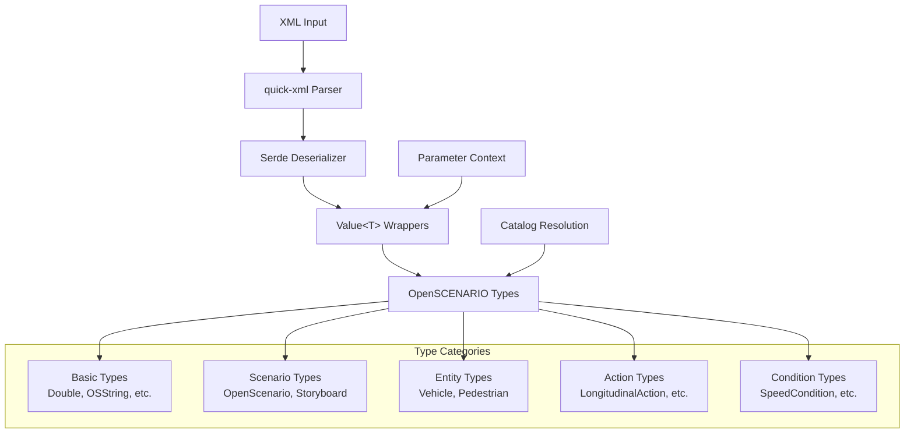
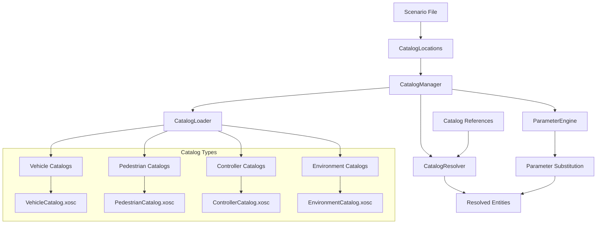

# OpenSCENARIO-rs User Guide

This comprehensive guide covers all aspects of using the OpenSCENARIO-rs library, from basic file parsing to advanced catalog management and scenario construction.

## Table of Contents

1. [Installation](#installation)
2. [Basic Concepts](#basic-concepts)
3. [File Parsing](#file-parsing)
4. [Type System](#type-system)
5. [Parameter Resolution](#parameter-resolution)
6. [Catalog Management](#catalog-management)
7. [Scenario Construction](#scenario-construction)
8. [Validation](#validation)
9. [XSD Compliance](#xsd-compliance)
10. [Error Handling](#error-handling)
11. [Performance Considerations](#performance-considerations)

## Installation

Add OpenSCENARIO-rs to your `Cargo.toml`:

```toml
[dependencies]
openscenario-rs = "0.1.0"

# Optional features
[dependencies.openscenario-rs]
version = "0.1.0"
features = ["builder", "validation"]
```

### Available Features

- **`builder`** - Enables programmatic scenario construction
- **`validation`** - Adds comprehensive validation capabilities

## Basic Concepts

### OpenSCENARIO Document Types

OpenSCENARIO-rs supports all three types of OpenSCENARIO documents:

```rust
use openscenario_rs::{parse_file, OpenScenarioDocumentType};

let document = parse_file("scenario.xosc")?;

match document.document_type() {
    OpenScenarioDocumentType::Scenario => {
        // Main scenario with entities, storyboard, etc.
        println!("Scenario file with {} entities", 
                 document.entities.as_ref().map_or(0, |e| e.scenario_objects.len()));
    }
    OpenScenarioDocumentType::Catalog => {
        // Catalog containing reusable elements
        println!("Catalog file");
    }
    OpenScenarioDocumentType::ParameterVariation => {
        // Parameter variation for batch simulation
        println!("Parameter variation file");
    }
    OpenScenarioDocumentType::Unknown => {
        println!("Unknown document type");
    }
}
```

### The Value<T> System

OpenSCENARIO-rs uses a `Value<T>` wrapper system to support parameterization:

```rust
use openscenario_rs::types::{Double, OSString};

// Value<f64> that can be a literal or parameter reference
let speed: Double = Double::literal(30.0);
let speed_param: Double = Double::parameter("${Speed}");

// Access literal values
if let Some(literal_speed) = speed.as_literal() {
    println!("Speed: {} m/s", literal_speed);
}

// Check if it's a parameter reference
if speed_param.is_parameter() {
    println!("Speed is parameterized");
}
```

## File Parsing

### Basic File Parsing

```rust
use openscenario_rs::{parse_file, parse_str, Result};

// Parse from file
fn parse_scenario_file() -> Result<()> {
    let scenario = parse_file("examples/highway_scenario.xosc")?;
    
    // Access file header
    println!("Author: {}", scenario.file_header.author.as_literal().unwrap());
    println!("Date: {}", scenario.file_header.date.as_literal().unwrap());
    println!("Description: {}", scenario.file_header.description.as_literal().unwrap());
    
    Ok(())
}

// Parse from string
fn parse_scenario_string() -> Result<()> {
    let xml_content = std::fs::read_to_string("scenario.xosc")?;
    let scenario = parse_str(&xml_content)?;
    
    // Process scenario...
    
    Ok(())
}
```

### Catalog File Parsing

```rust
use openscenario_rs::{parse_catalog_file, parse_catalog_str};

// Parse catalog file
let catalog = parse_catalog_file("catalogs/vehicles.xosc")?;

// Access catalog entries
for vehicle in &catalog.catalog.vehicles {
    println!("Vehicle: {}", vehicle.name.as_literal().unwrap());
}

// Parse catalog from string
let catalog_xml = std::fs::read_to_string("catalog.xosc")?;
let catalog = parse_catalog_str(&catalog_xml)?;
```

## Type System

### Core Data Flow



### Working with Entities

```rust
use openscenario_rs::types::{Vehicle, Pedestrian, ScenarioObject};

// Access scenario entities
if let Some(entities) = &scenario.entities {
    for scenario_object in &entities.scenario_objects {
        println!("Entity: {}", scenario_object.name.as_literal().unwrap());
        
        // Check entity type
        if let Some(entity_object) = &scenario_object.entity_object {
            match entity_object {
                EntityObject::Vehicle(vehicle) => {
                    println!("  Vehicle mass: {:?}", 
                             vehicle.properties.as_ref()
                                   .and_then(|p| p.mass.as_ref())
                                   .and_then(|m| m.as_literal()));
                }
                EntityObject::Pedestrian(pedestrian) => {
                    println!("  Pedestrian model: {}", 
                             pedestrian.model.as_literal().unwrap());
                }
                EntityObject::MiscObject(misc) => {
                    println!("  Misc object category: {:?}", misc.category);
                }
            }
        }
        
        // Check for catalog reference
        if let Some(catalog_ref) = &scenario_object.catalog_reference {
            println!("  References catalog: {}", 
                     catalog_ref.entry_name.as_literal().unwrap());
        }
    }
}
```

### Working with Actions

```rust
use openscenario_rs::types::actions::*;

// Access storyboard actions
if let Some(storyboard) = &scenario.storyboard {
    for story in &storyboard.story {
        for act in &story.acts {
            for maneuver_group in &act.maneuver_groups {
                for maneuver in &maneuver_group.maneuvers {
                    for event in &maneuver.events {
                        for action in &event.action {
                            match action {
                                Action::Private(private_action) => {
                                    match &private_action.action_type {
                                        PrivateActionType::LongitudinalAction(long_action) => {
                                            println!("Longitudinal action");
                                        }
                                        PrivateActionType::LateralAction(lat_action) => {
                                            println!("Lateral action");
                                        }
                                        // ... other action types
                                        _ => {}
                                    }
                                }
                                Action::UserDefined(user_action) => {
                                    println!("User-defined action");
                                }
                            }
                        }
                    }
                }
            }
        }
    }
}
```

### Working with Conditions

```rust
use openscenario_rs::types::conditions::*;

// Access trigger conditions
if let Some(storyboard) = &scenario.storyboard {
    for story in &storyboard.story {
        for act in &story.acts {
            for start_trigger in &act.start_trigger {
                for condition_group in &start_trigger.condition_groups {
                    for condition in &condition_group.conditions {
                        match &condition.condition_type {
                            ConditionType::ByEntity(entity_condition) => {
                                match &entity_condition.condition {
                                    EntityCondition::Distance(dist_condition) => {
                                        println!("Distance condition");
                                    }
                                    EntityCondition::Speed(speed_condition) => {
                                        println!("Speed condition");
                                    }
                                    // ... other entity conditions
                                    _ => {}
                                }
                            }
                            ConditionType::ByValue(value_condition) => {
                                match &value_condition.condition {
                                    ValueCondition::SimulationTime(time_condition) => {
                                        println!("Simulation time condition");
                                    }
                                    // ... other value conditions
                                    _ => {}
                                }
                            }
                        }
                    }
                }
            }
        }
    }
}
```

## Parameter Resolution

### Understanding Parameters

OpenSCENARIO supports parameter references using `${parameter_name}` syntax:

```rust
use openscenario_rs::types::{ParameterContext, Resolve};
use std::collections::HashMap;

// Create parameter context
let mut parameters = HashMap::new();
parameters.insert("Speed".to_string(), "30.0".to_string());
parameters.insert("Lane".to_string(), "1".to_string());
parameters.insert("VehicleModel".to_string(), "sedan".to_string());

let param_context = ParameterContext::new()
    .with_parameter("Speed".to_string(), "30.0".to_string())
    .with_parameter("Lane".to_string(), "1".to_string());

// Resolve parameter references
let speed_param = Double::parameter("${Speed}");
let resolved_speed: f64 = speed_param.resolve(&param_context)?;
println!("Resolved speed: {}", resolved_speed); // 30.0
```

### Extracting Scenario Parameters

```rust
use openscenario_rs::catalog::extract_scenario_parameters;

// Extract parameters from scenario
let scenario_params = extract_scenario_parameters(&scenario.parameter_declarations);

// Combine with additional parameters
let mut all_params = scenario_params;
all_params.insert("ExternalParam".to_string(), "value".to_string());
```

### Expression Evaluation

```rust
use openscenario_rs::expression::evaluate_expression;

let parameters = std::collections::HashMap::from([
    ("Speed".to_string(), "30.0".to_string()),
    ("Offset".to_string(), "5.0".to_string()),
]);

// Evaluate mathematical expressions
let result = evaluate_expression("${Speed + Offset * 2}", &parameters)?;
println!("Result: {}", result); // "40.0"

// Supported operations: +, -, *, /, (), sqrt, sin, cos, etc.
let complex_expr = "sqrt(${Speed} * ${Speed} + ${Offset} * ${Offset})";
let result = evaluate_expression(complex_expr, &parameters)?;
```

## Catalog Management

### Catalog System Architecture



### Setting Up Catalog Management

```rust
use openscenario_rs::catalog::{CatalogManager, extract_scenario_parameters};

// Create catalog manager
let mut catalog_manager = CatalogManager::new();

// Extract parameters from scenario
let scenario_params = extract_scenario_parameters(&scenario.parameter_declarations);
catalog_manager.set_global_parameters(scenario_params)?;

// Load catalogs from scenario locations
if let Some(catalog_locations) = &scenario.catalog_locations {
    catalog_manager.discover_and_load_catalogs(catalog_locations)?;
}
```

### Resolving Vehicle References

```rust
use openscenario_rs::types::catalogs::references::VehicleCatalogReference;

// Find vehicle catalog references in scenario
for scenario_object in &scenario.entities.unwrap().scenario_objects {
    if let Some(catalog_ref) = &scenario_object.catalog_reference {
        // This is a generic catalog reference - need to determine type
        println!("Found catalog reference: {}", 
                 catalog_ref.entry_name.as_literal().unwrap());
    }
    
    // Or check for specific vehicle references in entity properties
    if let Some(entity_object) = &scenario_object.entity_object {
        match entity_object {
            EntityObject::Vehicle(vehicle) => {
                // Vehicle loaded directly (not from catalog)
                println!("Direct vehicle: {}", vehicle.name.as_literal().unwrap());
            }
            _ => {}
        }
    }
}

// Resolve specific vehicle catalog reference
let vehicle_ref = VehicleCatalogReference {
    catalog_name: OSString::literal("VehicleCatalog".to_string()),
    entry_name: OSString::literal("sedan_vehicle".to_string()),
    parameter_assignments: None,
};

if let Some(vehicle_location) = &scenario.catalog_locations.unwrap().vehicle_catalog {
    let resolved_vehicle = catalog_manager
        .resolve_vehicle_reference(&vehicle_ref, vehicle_location)?;
    
    println!("Resolved vehicle: {:?}", resolved_vehicle.entity.name);
    println!("From catalog file: {}", resolved_vehicle.source_file);
}
```

### Working with Catalog Parameters

```rust
use openscenario_rs::types::basic::ParameterAssignment;

// Create vehicle reference with parameters
let vehicle_ref = VehicleCatalogReference {
    catalog_name: OSString::literal("VehicleCatalog".to_string()),
    entry_name: OSString::literal("parametric_vehicle".to_string()),
    parameter_assignments: Some(vec![
        ParameterAssignment {
            parameter_ref: OSString::literal("Mass".to_string()),
            value: OSString::literal("1500.0".to_string()),
        },
        ParameterAssignment {
            parameter_ref: OSString::literal("Color".to_string()),
            value: OSString::literal("red".to_string()),
        },
    ]),
};

// Resolve with parameters
let resolved = catalog_manager
    .resolve_vehicle_reference(&vehicle_ref, vehicle_location)?;

// Check resolved parameters
for (param, value) in &resolved.resolved_parameters {
    println!("Parameter {}: {}", param, value);
}
```

### Creating Custom Catalogs

```rust
use openscenario_rs::types::catalogs::files::{CatalogFile, Catalog};
use openscenario_rs::types::entities::Vehicle;

// Create a vehicle catalog programmatically
let vehicle = Vehicle::new("sports_car")
    .with_mass(1200.0)
    .with_performance(250.0, 12.0, 10.0); // max_speed, max_accel, max_decel

let catalog = Catalog {
    name: OSString::literal("CustomVehicles".to_string()),
    vehicles: vec![vehicle],
    pedestrians: vec![],
    misc_objects: vec![],
    controllers: vec![],
    environments: vec![],
    maneuvers: vec![],
    trajectories: vec![],
    routes: vec![],
};

let catalog_file = CatalogFile {
    file_header: FileHeader::new("Custom Catalog", "1.0"),
    catalog,
};

// Serialize catalog to XML
let xml = openscenario_rs::serialize_catalog_to_string(&catalog_file)?;
std::fs::write("custom_vehicles.xosc", xml)?;
```

## Scenario Construction

### Using the Builder Pattern

```rust
use openscenario_rs::builder::ScenarioBuilder;
use openscenario_rs::types::enums::{VehicleCategory, PedestrianCategory};

#[cfg(feature = "builder")]
fn build_scenario() -> Result<OpenScenario> {
    let scenario = ScenarioBuilder::new()
        .with_author("Scenario Generator")
        .with_description("Automatically generated scenario")
        .with_date("2024-01-15")
        
        // Add ego vehicle
        .add_vehicle("ego_vehicle")
            .with_category(VehicleCategory::Car)
            .with_model("sedan")
            .with_mass(1500.0)
            .with_max_speed(60.0)
            .with_max_acceleration(8.0)
            .with_max_deceleration(10.0)
        
        // Add pedestrian
        .add_pedestrian("pedestrian_1")
            .with_category(PedestrianCategory::Pedestrian)
            .with_model("adult_male")
            .with_mass(75.0)
        
        // Add initial actions
        .add_init_action()
            .for_entity("ego_vehicle")
            .teleport_to_world_position(100.0, 200.0, 0.0, 0.0, 0.0, 1.57)
        
        .add_init_action()
            .for_entity("pedestrian_1")
            .teleport_to_world_position(150.0, 205.0, 0.0, 0.0, 0.0, 0.0)
        
        // Add story with maneuvers
        .add_story("main_story")
            .add_act("setup_act")
                .add_maneuver_group("ego_maneuvers")
                    .actors(vec!["ego_vehicle"])
                    .add_maneuver("speed_up")
                        .add_event("accelerate_event")
                            .add_longitudinal_action()
                                .speed_action(30.0, TransitionDynamics::linear(2.0))
                            .add_start_trigger()
                                .simulation_time_condition(1.0)
        
        .build()?;
    
    Ok(scenario)
}
```

### Manual Construction

```rust
use openscenario_rs::types::*;
use openscenario_rs::types::scenario::*;

fn create_scenario_manually() -> Result<OpenScenario> {
    // Create file header
    let file_header = FileHeader {
        author: OSString::literal("Manual Builder".to_string()),
        date: OSString::literal("2024-01-15".to_string()),
        description: OSString::literal("Manually constructed scenario".to_string()),
        rev_major: UnsignedShort::literal(1),
        rev_minor: UnsignedShort::literal(0),
    };
    
    // Create vehicle
    let vehicle = Vehicle {
        name: OSString::literal("ego_vehicle".to_string()),
        vehicle_category: VehicleCategory::Car,
        properties: Some(VehicleProperties {
            mass: Some(Double::literal(1500.0)),
            // ... other properties
        }),
        // ... other vehicle fields
    };
    
    // Create scenario object
    let scenario_object = ScenarioObject {
        name: OSString::literal("ego_vehicle".to_string()),
        entity_object: Some(EntityObject::Vehicle(vehicle)),
        catalog_reference: None,
    };
    
    // Create entities
    let entities = Entities {
        scenario_objects: vec![scenario_object],
        entity_selections: vec![],
    };
    
    // Create init actions
    let teleport_action = TeleportAction {
        position: Position::WorldPosition(WorldPosition {
            x: Double::literal(100.0),
            y: Double::literal(200.0),
            z: Double::literal(0.0),
            h: Double::literal(0.0),
            p: Double::literal(0.0),
            r: Double::literal(0.0),
        }),
    };
    
    let private_action = PrivateAction {
        entity_ref: OSString::literal("ego_vehicle".to_string()),
        action_type: PrivateActionType::TeleportAction(teleport_action),
    };
    
    let init_actions = Init {
        actions: vec![Action::Private(private_action)],
    };
    
    // Create storyboard
    let storyboard = Storyboard {
        init: init_actions,
        story: vec![], // Add stories as needed
        stop_trigger: vec![], // Add stop triggers as needed
    };
    
    // Create final scenario
    let scenario = OpenScenario {
        file_header,
        parameter_declarations: None,
        catalog_locations: None,
        road_network: None,
        entities: Some(entities),
        storyboard: Some(storyboard),
    };
    
    Ok(scenario)
}
```

## Validation

### Built-in Validation

```rust
use openscenario_rs::types::{Validate, ValidationContext};

// Create validation context
let mut validation_context = ValidationContext::new()
    .with_strict_mode(); // Enable strict validation

// Add entities to validation context
for entity in &scenario.entities.unwrap().scenario_objects {
    validation_context.add_entity(
        entity.name.as_literal().unwrap().clone(),
        EntityRef {
            name: entity.name.as_literal().unwrap().clone(),
            object_type: ObjectType::Vehicle, // or appropriate type
        }
    );
}

// Validate scenario
scenario.validate(&validation_context)?;
```

### Custom Validation Rules

```rust
use openscenario_rs::types::{Validate, ValidationContext, Result};

// Implement custom validation for your types
impl Validate for CustomScenarioType {
    fn validate(&self, ctx: &ValidationContext) -> Result<()> {
        // Check entity references exist
        if let Some(entity_name) = self.entity_ref.as_literal() {
            if !ctx.entities.contains_key(entity_name) {
                return Err(Error::validation_error(
                    "entity_ref",
                    &format!("Entity '{}' not found", entity_name)
                ));
            }
        }
        
        // Check value constraints
        if let Some(speed) = self.target_speed.as_literal() {
            if *speed < 0.0 {
                return Err(Error::validation_error(
                    "target_speed",
                    "Speed cannot be negative"
                ));
            }
        }
        
        Ok(())
    }
}
```

### Schema Validation

```rust
use openscenario_rs::parser::validation::validate_against_schema;

// Validate XML against OpenSCENARIO XSD schema
let xml_content = std::fs::read_to_string("scenario.xosc")?;
validate_against_schema(&xml_content, "Schema/OpenSCENARIO.xsd")?;

// Then parse if validation succeeds
let scenario = parse_str(&xml_content)?;
```

## XSD Compliance

OpenSCENARIO-rs achieves 95%+ XSD validation compliance with the official OpenSCENARIO schema. The library generates XML that strictly adheres to the XSD specification.

### Key Features

- **Proper Attribute Handling**: Optional attributes are omitted when `None` instead of serialized as empty strings
- **Choice Group Compliance**: XSD choice groups serialize with correct wrapper elements
- **Schema Validation**: Built-in validation against OpenSCENARIO XSD standards
- **Backward Compatibility**: Existing XOSC files continue to parse correctly

### XSD-Compliant Serialization

```rust
use openscenario_rs::types::actions::movement::LaneChangeAction;

// Create action with optional offset
let action = LaneChangeAction {
    target_lane_offset: None, // Will be omitted in XML
    // ... other fields
};

// Serialize to XSD-compliant XML
let xml = quick_xml::se::to_string(&action)?;
// Output: <LaneChangeAction>...</LaneChangeAction>
// Note: No targetLaneOffset="" attribute present

// With value
let action_with_offset = LaneChangeAction {
    target_lane_offset: Some(Double::literal(0.5)),
    // ... other fields  
};

let xml = quick_xml::se::to_string(&action_with_offset)?;
// Output: <LaneChangeAction targetLaneOffset="0.5">...</LaneChangeAction>
```

### Handling Empty Attributes

The library gracefully handles empty attributes during deserialization:

```rust
// This XML with empty attribute...
let xml = r#"<LaneChangeAction targetLaneOffset="">...</LaneChangeAction>"#;

// ...deserializes correctly with None value
let action: LaneChangeAction = quick_xml::de::from_str(xml)?;
assert!(action.target_lane_offset.is_none());
```

### XSD Validation Tools

For strict XSD validation during development:

```rust
use openscenario_rs::examples::test_lane_change_serialization;

// Use the provided examples to validate serialization
test_lane_change_serialization(); // Validates XSD compliance
```

See [`docs/xsd_validation_fixes.md`](xsd_validation_fixes.md) for detailed implementation patterns and troubleshooting.

## Error Handling

### Error Types

```rust
use openscenario_rs::{Error, Result};

fn handle_parsing_errors() -> Result<()> {
    match parse_file("scenario.xosc") {
        Ok(scenario) => {
            println!("Parsed successfully");
            Ok(())
        }
        Err(Error::XmlParseError(e)) => {
            eprintln!("XML parsing failed: {}", e);
            Err(Error::XmlParseError(e))
        }
        Err(Error::IoError(e)) => {
            eprintln!("File I/O error: {}", e);
            Err(Error::IoError(e))
        }
        Err(Error::ValidationError { field, message }) => {
            eprintln!("Validation error in field '{}': {}", field, message);
            Err(Error::validation_error(&field, &message))
        }
        Err(Error::ParameterError { param, value }) => {
            eprintln!("Parameter '{}' error: {}", param, value);
            Err(Error::parameter_error(&param, &value))
        }
        Err(Error::EntityNotFound { entity }) => {
            eprintln!("Entity not found: {}", entity);
            Err(Error::EntityNotFound { entity })
        }
        Err(Error::CatalogNotFound { catalog, entry }) => {
            eprintln!("Catalog entry '{}' not found in catalog '{}'", entry, catalog);
            Err(Error::CatalogNotFound { catalog, entry })
        }
        Err(Error::CatalogError(msg)) => {
            eprintln!("Catalog error: {}", msg);
            Err(Error::CatalogError(msg))
        }
    }
}
```

### Error Context

```rust
// Add context to errors
let result = parse_file("scenario.xosc")
    .map_err(|e| e.with_context("Failed to parse main scenario file"));

// Create custom errors with context
let error = Error::validation_error("speed", "Invalid speed value")
    .with_context("While validating longitudinal action");
```

## Performance Considerations

### Memory Usage

The parser uses zero-copy deserialization for efficient memory usage.

### Caching Catalogs

```rust
// Cache catalog resolutions for repeated use
let mut catalog_manager = CatalogManager::new();

// Load catalogs once
catalog_manager.discover_and_load_catalogs(catalog_locations)?;

// Reuse for multiple scenarios
for scenario_file in scenario_files {
    let scenario = parse_file(&scenario_file)?;
    // Catalog resolution uses cached catalogs
    let resolved = resolve_scenario_catalogs(&scenario, &mut catalog_manager)?;
}
```

### Lazy Evaluation

```rust
// Parameters and catalogs are resolved on demand
let scenario = parse_file("scenario.xosc")?; // Fast - no catalog resolution yet

// Catalog resolution happens when needed
let resolved_vehicle = catalog_manager
    .resolve_vehicle_reference(&vehicle_ref, &vehicle_location)?; // Slower
```

### Zero-Copy Operations

```rust
// When possible, the library uses references to avoid copying
let entity_name = entity.name.as_literal().unwrap(); // &String, not String
let speed_value = speed.as_literal().unwrap(); // &f64, not f64

// Clone only when necessary
let owned_name = entity.name.as_literal().unwrap().clone(); // String
```

## Best Practices

1. **Use High-Level APIs**: Start with `parse_file()` and `CatalogManager`
2. **Handle Errors Properly**: Always check `Result` return values
3. **Cache Catalogs**: Reuse `CatalogManager` instances for multiple scenarios
4. **Validate Early**: Use validation APIs to catch errors early
5. **Parameter Management**: Extract and manage parameters systematically
6. **Type Safety**: Leverage the `Value<T>` system for parameter support

## Next Steps

- See [API Reference](api_reference.md) for detailed API documentation
- Check [Examples](../examples/) for real-world usage patterns
- Read [Development Guide](development_guide.md) for contributing guidelines