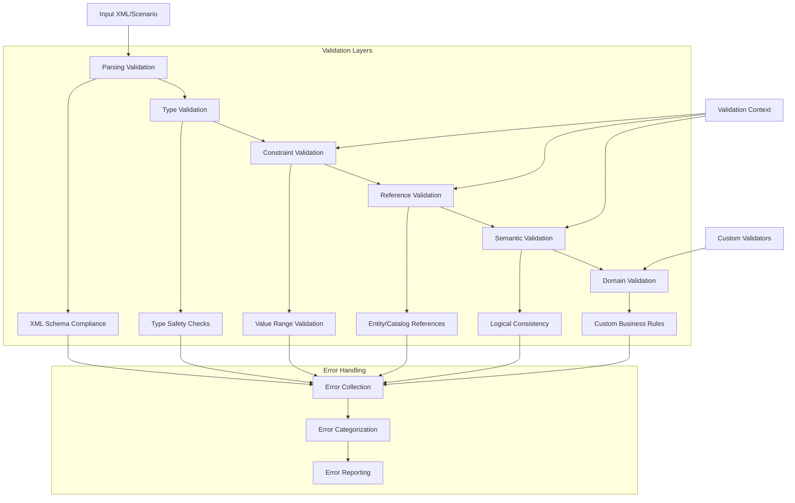

# OpenSCENARIO-rs Validation and Error Handling Guide

This guide covers the comprehensive validation system and error handling mechanisms in OpenSCENARIO-rs, including built-in validations, custom validation rules, and error management strategies.

## Table of Contents

1. [Validation System Overview](#validation-system-overview)
2. [Built-in Validations](#built-in-validations)
3. [Error Types](#error-types)
4. [Validation Context](#validation-context)
5. [Custom Validation](#custom-validation)
6. [Error Handling Patterns](#error-handling-patterns)
7. [Validation Best Practices](#validation-best-practices)
8. [Testing Validation](#testing-validation)

## Validation System Overview

OpenSCENARIO-rs implements a comprehensive validation system that operates at multiple levels to ensure scenario correctness and compliance with the OpenSCENARIO specification.

### Validation Architecture



### Validation Levels

1. **Parse-time Validation** - XML structure and type compliance
2. **Type Validation** - Rust type system enforcement
3. **Constraint Validation** - Value ranges and format requirements
4. **Reference Validation** - Entity and catalog reference integrity
5. **Semantic Validation** - Logical consistency and scenario validity
6. **Domain Validation** - Custom business rule enforcement

## Built-in Validations

### XML Schema Validation

The library automatically validates XML structure against the OpenSCENARIO XSD schema:

```rust
use openscenario_rs::parser::validation::validate_against_schema;

// Validate XML against schema before parsing
let xml_content = std::fs::read_to_string("scenario.xosc")?;
validate_against_schema(&xml_content, "Schema/OpenSCENARIO.xsd")?;

// Parse if validation succeeds
let scenario = parse_str(&xml_content)?;
```

### Type Safety Validation

Rust's type system provides compile-time validation:

```rust
// This won't compile - type safety enforced
// let speed: Double = "invalid";  // ERROR

// Correct usage
let speed = Double::literal(30.0);

// Runtime validation for Value<T> types
if let Some(speed_value) = speed.as_literal() {
    if *speed_value < 0.0 {
        return Err(Error::validation_error(
            "speed",
            "Speed cannot be negative"
        ));
    }
}
```

### Value Constraint Validation

Built-in validation for value ranges and constraints:

```rust
use openscenario_rs::types::{Range, ValueConstraint, Rule};

// Range validation
let speed_range = Range {
    lower_limit: Double::literal(0.0),
    upper_limit: Double::literal(80.0),  // 80 m/s = 288 km/h
};

// Value constraint validation
let speed_constraint = ValueConstraint {
    rule: Rule::GreaterThan,
    value: OSString::literal("0".to_string()),
};

// Apply validation
fn validate_speed_value(speed: &Double, range: &Range) -> Result<()> {
    if let Some(speed_val) = speed.as_literal() {
        if let (Some(min), Some(max)) = (
            range.lower_limit.as_literal(),
            range.upper_limit.as_literal()
        ) {
            if *speed_val < *min || *speed_val > *max {
                return Err(Error::validation_error(
                    "speed",
                    &format!("Speed {} not in range [{}, {}]", speed_val, min, max)
                ));
            }
        }
    }
    Ok(())
}
```

### Reference Validation

Validation of entity and catalog references:

```rust
use openscenario_rs::types::{Validate, ValidationContext, EntityRef, ObjectType};

impl Validate for SpeedCondition {
    fn validate(&self, ctx: &ValidationContext) -> Result<()> {
        // Validate triggering entities exist
        if let Some(triggering_entities) = &self.triggering_entities {
            for entity_ref in &triggering_entities.entity_refs {
                if let Some(entity_name) = entity_ref.entity_ref.as_literal() {
                    if !ctx.entities.contains_key(entity_name) {
                        return Err(Error::EntityNotFound {
                            entity: entity_name.clone()
                        });
                    }
                }
            }
        }
        
        // Validate speed value constraints
        if let Some(speed_val) = self.value.as_literal() {
            if *speed_val < 0.0 {
                return Err(Error::validation_error(
                    "value",
                    "Speed cannot be negative"
                ));
            }
        }
        
        Ok(())
    }
}
```

### Parameter Validation

Validation of parameter references and resolution:

```rust
use openscenario_rs::expression::evaluate_expression;

fn validate_parameter_expression(
    expr: &str,
    parameters: &HashMap<String, String>
) -> Result<()> {
    // Check if expression can be resolved
    match evaluate_expression(expr, parameters) {
        Ok(_) => Ok(()),
        Err(e) => Err(Error::parameter_error(expr, &e.to_string())),
    }
}

// Validate all parameters in scenario
fn validate_scenario_parameters(scenario: &OpenScenario) -> Result<()> {
    let scenario_params = extract_scenario_parameters(&scenario.parameter_declarations);
    
    // Validate parameter declarations
    if let Some(param_decls) = &scenario.parameter_declarations {
        for param in &param_decls.parameter_declarations {
            // Validate parameter name format
            if param.name.is_empty() {
                return Err(Error::validation_error(
                    "parameter_name",
                    "Parameter name cannot be empty"
                ));
            }
            
            // Validate parameter value can be parsed
            match param.parameter_type {
                ParameterType::Double => {
                    param.value.parse::<f64>().map_err(|_| {
                        Error::parameter_error(&param.name, "Invalid double value")
                    })?;
                }
                ParameterType::String => {
                    // String parameters are always valid
                }
                ParameterType::Int => {
                    param.value.parse::<i32>().map_err(|_| {
                        Error::parameter_error(&param.name, "Invalid integer value")
                    })?;
                }
                ParameterType::Boolean => {
                    param.value.parse::<bool>().map_err(|_| {
                        Error::parameter_error(&param.name, "Invalid boolean value")
                    })?;
                }
            }
        }
    }
    
    Ok(())
}
```

## Error Types

### Error Hierarchy

```rust
use openscenario_rs::{Error, Result};

// Main error types
#[derive(Error, Debug)]
pub enum Error {
    /// XML parsing failures
    #[error("XML parsing error: {0}")]
    XmlParseError(#[from] quick_xml::DeError),

    /// File I/O failures
    #[error("IO error: {0}")]
    IoError(#[from] std::io::Error),

    /// Schema validation failures
    #[error("Validation error in field '{field}': {message}")]
    ValidationError { field: String, message: String },

    /// Parameter resolution failures
    #[error("Parameter error for '{param}': {value}")]
    ParameterError { param: String, value: String },

    /// Missing entity reference
    #[error("Entity not found: {entity}")]
    EntityNotFound { entity: String },

    /// Missing catalog reference
    #[error("Catalog entry not found: {entry} in catalog {catalog}")]
    CatalogNotFound { catalog: String, entry: String },

    /// Catalog system errors
    #[error("Catalog error: {0}")]
    CatalogError(String),
}
```

### Error Creation Helpers

```rust
impl Error {
    /// Add context to an error
    pub fn with_context(self, context: &str) -> Self {
        match self {
            Error::ValidationError { field, message } => Error::ValidationError {
                field,
                message: format!("{}: {}", context, message),
            },
            other => other,
        }
    }

    /// Create a parsing error with location information
    pub fn parsing_error(msg: &str, line: usize, col: usize) -> Self {
        Error::ValidationError {
            field: format!("line {}, column {}", line, col),
            message: msg.to_string(),
        }
    }

    /// Create a parameter error
    pub fn parameter_error(param: &str, value: &str) -> Self {
        Error::ParameterError {
            param: param.to_string(),
            value: value.to_string(),
        }
    }

    /// Create a validation error
    pub fn validation_error(field: &str, message: &str) -> Self {
        Error::ValidationError {
            field: field.to_string(),
            message: message.to_string(),
        }
    }
}
```

### Error Context and Chaining

```rust
use anyhow::Context; // Optional: for enhanced error context

fn parse_and_validate_scenario(path: &str) -> Result<OpenScenario> {
    // Chain errors with context
    let scenario = parse_file(path)
        .map_err(|e| e.with_context(&format!("Failed to parse {}", path)))?;
    
    // Validate with context
    let validation_context = ValidationContext::new().with_strict_mode();
    scenario.validate(&validation_context)
        .map_err(|e| e.with_context("Scenario validation failed"))?;
    
    Ok(scenario)
}

// Error propagation with additional context
fn process_scenario_batch(files: &[&str]) -> Result<Vec<OpenScenario>> {
    let mut scenarios = Vec::new();
    
    for (index, file) in files.iter().enumerate() {
        let scenario = parse_and_validate_scenario(file)
            .map_err(|e| e.with_context(&format!("Processing file {} of {}", index + 1, files.len())))?;
        scenarios.push(scenario);
    }
    
    Ok(scenarios)
}
```

## Validation Context

### Validation Context Structure

```rust
#[derive(Debug, Default)]
pub struct ValidationContext {
    /// Registry of all entities in the scenario for reference validation
    pub entities: HashMap<String, EntityRef>,
    /// Available catalog entries for catalog reference validation  
    pub catalogs: HashMap<String, CatalogRef>,
    /// Validation settings and options
    pub strict_mode: bool,
    /// Custom validation data
    pub custom_data: HashMap<String, Box<dyn std::any::Any>>,
}

impl ValidationContext {
    pub fn new() -> Self {
        Self::default()
    }

    pub fn with_strict_mode(mut self) -> Self {
        self.strict_mode = true;
        self
    }

    pub fn add_entity(&mut self, name: String, entity_ref: EntityRef) {
        self.entities.insert(name, entity_ref);
    }
    
    pub fn add_catalog(&mut self, name: String, catalog_ref: CatalogRef) {
        self.catalogs.insert(name, catalog_ref);
    }
    
    pub fn set_custom_data<T: 'static>(&mut self, key: String, data: T) {
        self.custom_data.insert(key, Box::new(data));
    }
    
    pub fn get_custom_data<T: 'static>(&self, key: &str) -> Option<&T> {
        self.custom_data.get(key)?.downcast_ref()
    }
}
```

### Building Validation Context

```rust
fn build_validation_context(scenario: &OpenScenario) -> ValidationContext {
    let mut context = ValidationContext::new().with_strict_mode();
    
    // Add entities to context
    if let Some(entities) = &scenario.entities {
        for entity in &entities.scenario_objects {
            if let Some(name) = entity.name.as_literal() {
                let entity_ref = EntityRef {
                    name: name.clone(),
                    object_type: determine_entity_type(&entity.entity_object),
                };
                context.add_entity(name.clone(), entity_ref);
            }
        }
    }
    
    // Add catalog information
    if let Some(catalog_locations) = &scenario.catalog_locations {
        // Load catalog references...
    }
    
    // Add custom validation data
    context.set_custom_data("scenario_version".to_string(), "1.3".to_string());
    
    context
}

fn determine_entity_type(entity_object: &Option<EntityObject>) -> ObjectType {
    match entity_object {
        Some(EntityObject::Vehicle(_)) => ObjectType::Vehicle,
        Some(EntityObject::Pedestrian(_)) => ObjectType::Pedestrian,
        Some(EntityObject::MiscObject(_)) => ObjectType::MiscObject,
        None => ObjectType::Vehicle, // Default
    }
}
```

## Custom Validation

### Implementing Custom Validators

```rust
use openscenario_rs::types::{Validate, ValidationContext, Result};

// Custom validation for realistic physics
pub struct PhysicsValidator;

impl PhysicsValidator {
    pub fn validate_acceleration_limits(&self, action: &SpeedAction) -> Result<()> {
        if let Some(dynamics) = &action.speed_action_dynamics {
            if let Some(value) = dynamics.value.as_literal() {
                // Check realistic acceleration limits
                if *value > 15.0 {  // 15 m/s² is extreme for most vehicles
                    return Err(Error::validation_error(
                        "acceleration",
                        "Acceleration exceeds realistic limits for automotive scenarios"
                    ));
                }
            }
        }
        Ok(())
    }
    
    pub fn validate_speed_limits(&self, speed: f64, road_type: &str) -> Result<()> {
        let max_speed = match road_type {
            "urban" => 50.0 / 3.6,      // 50 km/h in m/s
            "rural" => 100.0 / 3.6,     // 100 km/h in m/s
            "highway" => 130.0 / 3.6,   // 130 km/h in m/s
            _ => 200.0 / 3.6,           // Default high limit
        };
        
        if speed > max_speed {
            return Err(Error::validation_error(
                "speed",
                &format!("Speed {:.1} km/h exceeds {} road limit", speed * 3.6, road_type)
            ));
        }
        
        Ok(())
    }
}

// Domain-specific validation trait
pub trait DomainValidator {
    fn validate_scenario(&self, scenario: &OpenScenario, context: &ValidationContext) -> Result<()>;
    fn validate_action(&self, action: &Action, context: &ValidationContext) -> Result<()>;
    fn validate_condition(&self, condition: &Condition, context: &ValidationContext) -> Result<()>;
}

// Automotive domain validator
pub struct AutomotiveValidator {
    physics: PhysicsValidator,
    safety_standards: SafetyStandards,
}

impl DomainValidator for AutomotiveValidator {
    fn validate_scenario(&self, scenario: &OpenScenario, context: &ValidationContext) -> Result<()> {
        // Validate scenario-level automotive constraints
        self.validate_vehicle_specifications(scenario)?;
        self.validate_road_network(scenario)?;
        self.validate_traffic_rules(scenario, context)?;
        Ok(())
    }
    
    fn validate_action(&self, action: &Action, context: &ValidationContext) -> Result<()> {
        match action {
            Action::Private(private_action) => {
                match &private_action.action_type {
                    PrivateActionType::LongitudinalAction(long_action) => {
                        self.validate_longitudinal_action(long_action, context)?;
                    }
                    PrivateActionType::LateralAction(lat_action) => {
                        self.validate_lateral_action(lat_action, context)?;
                    }
                    _ => {}
                }
            }
            _ => {}
        }
        Ok(())
    }
    
    fn validate_condition(&self, condition: &Condition, context: &ValidationContext) -> Result<()> {
        // Validate automotive-specific conditions
        match &condition.condition_type {
            ConditionType::ByEntity(entity_condition) => {
                self.validate_entity_condition(entity_condition, context)?;
            }
            ConditionType::ByValue(value_condition) => {
                self.validate_value_condition(value_condition, context)?;
            }
        }
        Ok(())
    }
}

impl AutomotiveValidator {
    fn validate_longitudinal_action(
        &self,
        action: &LongitudinalAction,
        context: &ValidationContext
    ) -> Result<()> {
        match action {
            LongitudinalAction::SpeedAction(speed_action) => {
                self.physics.validate_acceleration_limits(speed_action)?;
                
                // Validate target speed is reasonable
                if let Some(target_speed) = self.extract_target_speed(speed_action) {
                    self.physics.validate_speed_limits(target_speed, "highway")?;
                }
            }
            _ => {}
        }
        Ok(())
    }
    
    fn extract_target_speed(&self, action: &SpeedAction) -> Option<f64> {
        match &action.speed_target {
            SpeedTarget::AbsoluteTargetSpeed(abs_speed) => {
                abs_speed.value.as_literal().copied()
            }
            SpeedTarget::RelativeTargetSpeed(rel_speed) => {
                // Would need context to calculate absolute speed
                rel_speed.value.as_literal().copied()
            }
        }
    }
}
```

### Validation Pipeline

```rust
pub struct ValidationPipeline {
    validators: Vec<Box<dyn DomainValidator>>,
    context: ValidationContext,
}

impl ValidationPipeline {
    pub fn new() -> Self {
        Self {
            validators: Vec::new(),
            context: ValidationContext::new(),
        }
    }
    
    pub fn add_validator(&mut self, validator: Box<dyn DomainValidator>) {
        self.validators.push(validator);
    }
    
    pub fn with_context(mut self, context: ValidationContext) -> Self {
        self.context = context;
        self
    }
    
    pub fn validate_scenario(&self, scenario: &OpenScenario) -> ValidationReport {
        let mut errors = Vec::new();
        
        // Run built-in validation first
        if let Err(e) = scenario.validate(&self.context) {
            errors.push(ValidationIssue::from_error(e, ValidationSeverity::Error));
        }
        
        // Run custom validators
        for validator in &self.validators {
            if let Err(e) = validator.validate_scenario(scenario, &self.context) {
                errors.push(ValidationIssue::from_error(e, ValidationSeverity::Error));
            }
        }
        
        // Validate actions and conditions
        self.validate_storyboard_elements(scenario, &mut errors);
        
        ValidationReport { issues: errors }
    }
    
    fn validate_storyboard_elements(
        &self,
        scenario: &OpenScenario,
        errors: &mut Vec<ValidationIssue>
    ) {
        if let Some(storyboard) = &scenario.storyboard {
            // Validate init actions
            for action in &storyboard.init.actions {
                for validator in &self.validators {
                    if let Err(e) = validator.validate_action(action, &self.context) {
                        errors.push(ValidationIssue::from_error(e, ValidationSeverity::Error));
                    }
                }
            }
            
            // Validate story elements
            for story in &storyboard.story {
                for act in &story.acts {
                    // Validate maneuver groups and their actions...
                }
            }
        }
    }
}

#[derive(Debug, Clone)]
pub struct ValidationIssue {
    pub severity: ValidationSeverity,
    pub category: ValidationCategory,
    pub field_path: String,
    pub message: String,
    pub suggestion: Option<String>,
    pub line_number: Option<usize>,
}

#[derive(Debug, Clone, Copy, PartialEq)]
pub enum ValidationSeverity {
    Error,
    Warning,
    Info,
}

#[derive(Debug, Clone, Copy, PartialEq)]
pub enum ValidationCategory {
    Syntax,
    Type,
    Reference,
    Constraint,
    Physics,
    Safety,
    Performance,
}

#[derive(Debug)]
pub struct ValidationReport {
    pub issues: Vec<ValidationIssue>,
}

impl ValidationReport {
    pub fn has_errors(&self) -> bool {
        self.issues.iter().any(|i| i.severity == ValidationSeverity::Error)
    }
    
    pub fn error_count(&self) -> usize {
        self.issues.iter().filter(|i| i.severity == ValidationSeverity::Error).count()
    }
    
    pub fn warning_count(&self) -> usize {
        self.issues.iter().filter(|i| i.severity == ValidationSeverity::Warning).count()
    }
    
    pub fn filter_by_severity(&self, severity: ValidationSeverity) -> Vec<&ValidationIssue> {
        self.issues.iter().filter(|i| i.severity == severity).collect()
    }
    
    pub fn filter_by_category(&self, category: ValidationCategory) -> Vec<&ValidationIssue> {
        self.issues.iter().filter(|i| i.category == category).collect()
    }
}
```

## Error Handling Patterns

### Graceful Error Handling

```rust
use anyhow::{Context, Result as AnyhowResult};

// Comprehensive error handling for scenario processing
pub fn process_scenario_with_fallbacks(
    primary_file: &str,
    fallback_files: &[&str]
) -> AnyhowResult<OpenScenario> {
    // Try primary file first
    match parse_and_validate_scenario(primary_file) {
        Ok(scenario) => return Ok(scenario),
        Err(e) => {
            eprintln!("Primary file failed: {}", e);
            
            // Try fallback files
            for fallback in fallback_files {
                match parse_and_validate_scenario(fallback) {
                    Ok(scenario) => {
                        eprintln!("Using fallback file: {}", fallback);
                        return Ok(scenario);
                    }
                    Err(e) => {
                        eprintln!("Fallback {} failed: {}", fallback, e);
                    }
                }
            }
        }
    }
    
    Err(anyhow::anyhow!("All scenario files failed to parse"))
}

// Error recovery with partial parsing
pub fn parse_scenario_with_recovery(xml: &str) -> (Option<OpenScenario>, Vec<Error>) {
    let mut errors = Vec::new();
    
    // Try standard parsing first
    match parse_str(xml) {
        Ok(scenario) => (Some(scenario), errors),
        Err(e) => {
            errors.push(e);
            
            // Try recovery parsing (simplified structure)
            match parse_with_recovery_mode(xml) {
                Ok(scenario) => (Some(scenario), errors),
                Err(recovery_error) => {
                    errors.push(recovery_error);
                    (None, errors)
                }
            }
        }
    }
}

fn parse_with_recovery_mode(xml: &str) -> Result<OpenScenario> {
    // Simplified parsing that ignores optional elements
    // and uses defaults for missing required elements
    todo!()
}
```

### Error Aggregation

```rust
pub struct ErrorCollector {
    errors: Vec<Error>,
    warnings: Vec<Error>,
    context_stack: Vec<String>,
}

impl ErrorCollector {
    pub fn new() -> Self {
        Self {
            errors: Vec::new(),
            warnings: Vec::new(),
            context_stack: Vec::new(),
        }
    }
    
    pub fn push_context(&mut self, context: String) {
        self.context_stack.push(context);
    }
    
    pub fn pop_context(&mut self) {
        self.context_stack.pop();
    }
    
    pub fn add_error(&mut self, mut error: Error) {
        // Add current context to error
        if !self.context_stack.is_empty() {
            let context = self.context_stack.join(" -> ");
            error = error.with_context(&context);
        }
        self.errors.push(error);
    }
    
    pub fn add_warning(&mut self, mut warning: Error) {
        if !self.context_stack.is_empty() {
            let context = self.context_stack.join(" -> ");
            warning = warning.with_context(&context);
        }
        self.warnings.push(warning);
    }
    
    pub fn has_errors(&self) -> bool {
        !self.errors.is_empty()
    }
    
    pub fn into_result<T>(self, value: T) -> Result<T> {
        if self.has_errors() {
            // Return first error, but could be aggregated
            Err(self.errors.into_iter().next().unwrap())
        } else {
            Ok(value)
        }
    }
}

// Usage with error collector
fn validate_scenario_comprehensive(scenario: &OpenScenario) -> Result<ValidationReport> {
    let mut collector = ErrorCollector::new();
    
    collector.push_context("Scenario Validation".to_string());
    
    // Validate file header
    collector.push_context("File Header".to_string());
    if let Err(e) = validate_file_header(&scenario.file_header) {
        collector.add_error(e);
    }
    collector.pop_context();
    
    // Validate entities
    if let Some(entities) = &scenario.entities {
        collector.push_context("Entities".to_string());
        for (i, entity) in entities.scenario_objects.iter().enumerate() {
            collector.push_context(format!("Entity {}", i));
            if let Err(e) = validate_entity(entity) {
                collector.add_error(e);
            }
            collector.pop_context();
        }
        collector.pop_context();
    }
    
    collector.pop_context();
    
    // Convert to validation report
    let report = ValidationReport {
        issues: collector.errors.into_iter()
            .map(|e| ValidationIssue::from_error(e, ValidationSeverity::Error))
            .chain(
                collector.warnings.into_iter()
                    .map(|e| ValidationIssue::from_error(e, ValidationSeverity::Warning))
            )
            .collect()
    };
    
    Ok(report)
}
```

## Validation Best Practices

### 1. Fail Fast vs. Collect All Errors

```rust
// Fail fast approach - stop at first error
pub fn validate_fail_fast(scenario: &OpenScenario) -> Result<()> {
    // Stop immediately on first validation failure
    validate_file_header(&scenario.file_header)?;
    validate_entities(&scenario.entities)?;
    validate_storyboard(&scenario.storyboard)?;
    Ok(())
}

// Collect all errors approach - comprehensive validation
pub fn validate_comprehensive(scenario: &OpenScenario) -> ValidationReport {
    let mut issues = Vec::new();
    
    // Continue validation even after errors
    if let Err(e) = validate_file_header(&scenario.file_header) {
        issues.push(ValidationIssue::from_error(e, ValidationSeverity::Error));
    }
    
    if let Err(e) = validate_entities(&scenario.entities) {
        issues.push(ValidationIssue::from_error(e, ValidationSeverity::Error));
    }
    
    if let Err(e) = validate_storyboard(&scenario.storyboard) {
        issues.push(ValidationIssue::from_error(e, ValidationSeverity::Error));
    }
    
    ValidationReport { issues }
}
```

### 2. Contextual Error Messages

```rust
// Poor error message
fn bad_validation_example(speed: f64) -> Result<()> {
    if speed < 0.0 {
        return Err(Error::validation_error("speed", "Invalid"));
    }
    Ok(())
}

// Good error message with context
fn good_validation_example(
    speed: f64,
    entity_name: &str,
    action_type: &str
) -> Result<()> {
    if speed < 0.0 {
        return Err(Error::validation_error(
            "speed",
            &format!(
                "Speed value {} is negative for entity '{}' in {} action. Speed must be non-negative.",
                speed, entity_name, action_type
            )
        ));
    }
    
    if speed > 83.33 {  // 300 km/h
        return Err(Error::validation_error(
            "speed",
            &format!(
                "Speed value {} ({:.0} km/h) for entity '{}' exceeds realistic limits. Consider values below 83.33 m/s (300 km/h).",
                speed, speed * 3.6, entity_name
            )
        ));
    }
    
    Ok(())
}
```

### 3. Layered Validation Strategy

```rust
pub enum ValidationLevel {
    Minimal,     // Only critical errors
    Standard,    // Standard compliance
    Strict,      // Enhanced validation
    Domain,      // Domain-specific rules
}

pub fn validate_with_level(
    scenario: &OpenScenario,
    level: ValidationLevel
) -> ValidationReport {
    let mut pipeline = ValidationPipeline::new();
    
    match level {
        ValidationLevel::Minimal => {
            // Only schema and type validation
        }
        ValidationLevel::Standard => {
            // Add reference and constraint validation
            pipeline.add_validator(Box::new(StandardValidator));
        }
        ValidationLevel::Strict => {
            // Add enhanced checking
            pipeline.add_validator(Box::new(StandardValidator));
            pipeline.add_validator(Box::new(StrictValidator));
        }
        ValidationLevel::Domain => {
            // Add domain-specific validation
            pipeline.add_validator(Box::new(StandardValidator));
            pipeline.add_validator(Box::new(AutomotiveValidator::new()));
            pipeline.add_validator(Box::new(PhysicsValidator));
        }
    }
    
    pipeline.validate_scenario(scenario)
}
```

## Testing Validation

### Unit Testing Validation Rules

```rust
#[cfg(test)]
mod validation_tests {
    use super::*;
    
    #[test]
    fn test_speed_validation_positive() {
        let speed = Double::literal(30.0);
        let result = validate_speed_value(&speed, "highway");
        assert!(result.is_ok());
    }
    
    #[test]
    fn test_speed_validation_negative() {
        let speed = Double::literal(-10.0);
        let result = validate_speed_value(&speed, "highway");
        
        assert!(result.is_err());
        match result.unwrap_err() {
            Error::ValidationError { field, message } => {
                assert_eq!(field, "speed");
                assert!(message.contains("negative"));
            }
            _ => panic!("Expected validation error"),
        }
    }
    
    #[test]
    fn test_entity_reference_validation() {
        let mut context = ValidationContext::new();
        context.add_entity("vehicle1".to_string(), EntityRef {
            name: "vehicle1".to_string(),
            object_type: ObjectType::Vehicle,
        });
        
        // Valid reference
        let valid_condition = SpeedCondition {
            entity_ref: OSString::literal("vehicle1".to_string()),
            value: Double::literal(30.0),
            rule: Rule::GreaterThan,
        };
        assert!(valid_condition.validate(&context).is_ok());
        
        // Invalid reference
        let invalid_condition = SpeedCondition {
            entity_ref: OSString::literal("nonexistent".to_string()),
            value: Double::literal(30.0),
            rule: Rule::GreaterThan,
        };
        assert!(invalid_condition.validate(&context).is_err());
    }
}
```

### Integration Testing

```rust
#[test]
fn test_complete_scenario_validation() {
    let scenario = parse_file("tests/data/valid_scenario.xosc").unwrap();
    
    let context = build_validation_context(&scenario);
    let result = scenario.validate(&context);
    
    assert!(result.is_ok(), "Valid scenario should pass validation");
}

#[test]
fn test_invalid_scenario_validation() {
    let scenario = parse_file("tests/data/invalid_scenario.xosc").unwrap();
    
    let context = build_validation_context(&scenario);
    let result = scenario.validate(&context);
    
    assert!(result.is_err(), "Invalid scenario should fail validation");
}

#[test]
fn test_validation_pipeline() {
    let scenario = parse_file("tests/data/automotive_scenario.xosc").unwrap();
    
    let mut pipeline = ValidationPipeline::new();
    pipeline.add_validator(Box::new(AutomotiveValidator::new()));
    
    let report = pipeline.validate_scenario(&scenario);
    
    // Check specific validation results
    assert!(!report.has_errors(), "Automotive scenario should be valid");
    assert_eq!(report.warning_count(), 0);
}
```

This comprehensive validation system ensures that OpenSCENARIO scenarios are not only syntactically correct but also semantically meaningful and domain-appropriate, providing developers with detailed feedback for creating robust simulation scenarios.